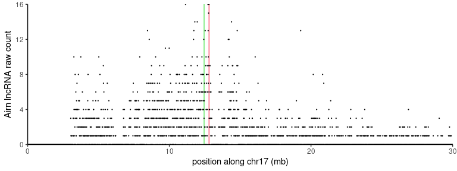

-   <a
    href="#dcon-probabilistic-deconvolution-of-chromatin-interaction-signal-in-3d-genome-data"
    id="toc-dcon-probabilistic-deconvolution-of-chromatin-interaction-signal-in-3d-genome-data">dcon:
    Probabilistic deconvolution of chromatin interaction signal in 3D genome
    data</a>
    -   <a href="#quick-start" id="toc-quick-start">Quick Start</a>
    -   <a href="#vignettes" id="toc-vignettes">Vignettes</a>
    -   <a href="#citation" id="toc-citation">Citation</a>
    -   <a href="#figures-from-the-manuscript"
        id="toc-figures-from-the-manuscript">Figures from the manuscript</a>

# dcon: Probabilistic deconvolution of chromatin interaction signal in 3D genome data

## Quick Start

We provide a quick, self-contained example to show how the method works.
For more details, see everything below the quick start section.

Here, we use a small sample of the RD-SPRITE data
([GSE151515](https://www.ncbi.nlm.nih.gov/geo/query/acc.cgi?acc=GSE151515)).

We focus on the lncRNA *Airn* which is a part of the *Igf2r* imprinted
cluster on chromosome 17 (mm10) and is thought to orchestrate silencing
of the gene *Slc22a3*.

Zoom-in on the first 30mb of chr17, which contains the *Airn* locus.

``` r
airn <- readRDS(system.file("extdata", "airn.rds", package="dcon"))
```

``` r
airn |>
  filter(start <= 30e6) |>
  ggplot(aes(x = start/1e6, y = count)) +
  geom_rect(xmin = 12739311/1e6, xmax = 12861884/1e6,
            ymin = 0, ymax = max(airn$count),
            fill = 'lightpink') +
  geom_rect(xmin = 12417972/1e6, xmax = 12509704/1e6,
            ymin = 0, ymax = max(airn$count),
            fill = 'lightgreen') +
  geom_point(size=0.1) +
  scale_y_continuous(expand=c(0,0)) +
  scale_x_continuous(expand=c(0,0)) +
  theme_classic() +
  xlab('position along chr17 (mb)') +
  ylab('Airn lncRNA raw count')
```



## Vignettes

-   [Deconvolution in
    1D](https://github.com/lulizou/dcon/blob/main/vignettes/demo_1d.md)
-   [Loop
    deconvolution](https://github.com/lulizou/dcon/blob/main/vignettes/demo_2d.md)
-   [Simulating
    data](https://github.com/lulizou/dcon/blob/main/vignettes/simulations.md)

## Citation

## Figures from the manuscript

-   [RD-SPRITE
    tracks](https://github.com/lulizou/dcon/blob/main/vignettes/rdsprite_track_plots.md)
