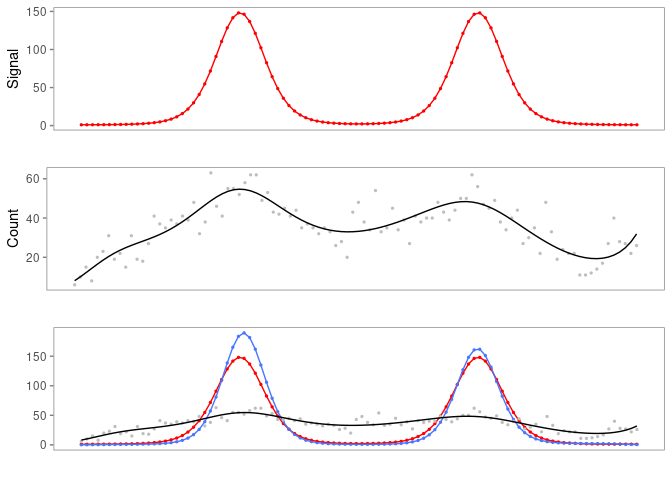

Deconvolution in 1D
================

-   <a href="#quick-start" id="toc-quick-start">Quick start</a>
-   <a href="#model" id="toc-model">Model</a>
-   <a href="#preprocessing-dna-dna-matrix"
    id="toc-preprocessing-dna-dna-matrix">Preprocessing: DNA-DNA matrix</a>
    -   <a href="#normalization-and-smoothing"
        id="toc-normalization-and-smoothing">Normalization and smoothing</a>
    -   <a href="#setting-gamma-the-amount-of-deconvolution"
        id="toc-setting-gamma-the-amount-of-deconvolution">Setting gamma, the
        amount of deconvolution</a>
-   <a href="#simulated-data" id="toc-simulated-data">Simulated data</a>
    -   <a href="#gamma-and-degrees-of-freedom"
        id="toc-gamma-and-degrees-of-freedom">Gamma and degrees of freedom</a>
        -   <a href="#using-true-df" id="toc-using-true-df">Using true df</a>
        -   <a href="#multiple-peaks" id="toc-multiple-peaks">Multiple peaks</a>
    -   <a href="#plots-for-show" id="toc-plots-for-show">Plots for show</a>

This vignette walks through deconvolution in 1D.

``` r
library(data.table)
library(dplyr)
```


    Attaching package: 'dplyr'

    The following objects are masked from 'package:data.table':

        between, first, last

    The following objects are masked from 'package:stats':

        filter, lag

    The following objects are masked from 'package:base':

        intersect, setdiff, setequal, union

``` r
library(tidyr)
library(ggplot2)
library(gridExtra)
```


    Attaching package: 'gridExtra'

    The following object is masked from 'package:dplyr':

        combine

``` r
library(dcon)
set.seed(4)
```

# Quick start

We first provide a quick, self-contained example to show how the method
works. For more details, see everything below the quick start section.

Here, we use a small sample of the RD-SPRITE data
([GSE151515](https://www.ncbi.nlm.nih.gov/geo/query/acc.cgi?acc=GSE151515)).

We focus on the lncRNA *Airn* which is a part of the *Igf2r* imprinted
cluster on chromosome 17 (mm10) and is thought to orchestrate silencing
of the gene *Slc22a3*.

Zoom-in on the first 30mb of chr17, which contains the *Airn* locus.

``` r
airn <- fread('/rafalab/lzou/rdsprite/count_windows/Airn_RNA_count_windows_10000_clusters_2-1000_chr17_129S1_SvImJ.csv') |>
  filter(chrom=='chr17')
```

``` r
airn |>
  filter(start <= 30e6) |>
  ggplot(aes(x = start/1e6, y = count)) +
  geom_rect(xmin = 12739311/1e6, xmax = 12861884/1e6,
            ymin = 0, ymax = max(airn$count),
            fill = 'lightpink') +
  geom_rect(xmin = 12417972/1e6, xmax = 12509704/1e6,
            ymin = 0, ymax = max(airn$count),
            fill = 'lightgreen') +
  geom_point(size=0.1) +
  scale_y_continuous(expand=c(0,0)) +
  scale_x_continuous(expand=c(0,0)) +
  theme_classic() +
  xlab('position along chr17 (mb)') +
  ylab('Airn lncRNA raw count')
```


# Model

The model for deconvolution is

$$Y \sim \text{Poisson}(D\lambda)$$

$$\text{log}(\lambda) = B\alpha$$

where $D$ represents the DNA-DNA contact matrix and $\lambda$ the true,
underlying signal. $B$ are Gaussian basis functions and $\alpha$ are the
coefficients to be estimated.

# Preprocessing: DNA-DNA matrix

Before we deconvolve, it is important to inspect the DNA-DNA contact
matrix and preprocess it. The default parameters should work in many
cases, but it is also good to manually inspect what is happening.

Here, we use an example DNA matrix, taken from the *Kcnq1ot1* imprinted
region (a 1mb region around the *Kcnq1ot1* locus) at 10kb bin
resolution.

``` r
dd <- readRDS(system.file("extdata", "rdsprite_kcnq1ot1_domain_DD.rds", package="dcon"))
dd <- as.matrix(dd)
plot_mat(dd, main = expression(paste('Raw DNA-DNA contacts at the ', italic('Kcnq1ot1'), ' locus (1mb)')))
```


## Normalization and smoothing

There are a few important tuning parameters to normalize and smooth the
DNA-DNA contact matrix with `normalize_hic`.

1.  `threshold` - for setting a threshold for the total number of
    contacts necessary per column to be considered for deconvolution;
    otherwise it can be quite noisy if there are gaps. For example, note
    that the center cross where there is no signal is because of the
    repetitive LINE element located inside of the Kcnq1ot1 locus, which
    is difficult to map reads to. The default threshold is set to be the
    bottom 0.5% quantile of the `colSums` of the matrix, but this can
    also be manually adjusted with `threshold=`.
2.  `smooth` - `TRUE` or `FALSE`, this uses a Gaussian blur to smooth
    the matrix. This takes care of instances like above where such
    mapping discrepancies can result in ‘holes’ in the matrix.
3.  `sigma` - the SD of the Gaussian blur which controls the amount of
    smoothing to apply. Default is `sigma=1`.

Finally, after thresholding and smoothing, the matrix is
column-normalized.

We illustrate the importance of these steps below:

With no thresholding, we see that there are indeed some spurious reads
in those ‘empty’ gaps, and if we just column-normalize, we end up
getting a messy signal:

``` r
ddnorm <- normalize_hic(dd, threshold=0)
plot_mat(ddnorm, main = 'Column-normalized, with no thresholding or smoothing')
```


The default amount of thresholding clears out the signal in the lowest
0.5% of bins and sets all the signal to be on the diagonal. Smoothing
helps essentially impute nearby values that are lost. Note that we
choose not to make any assumptions about how the ‘empty’ region
interacts with distant regions; the blur effectively smooths over
contacts with nearby regions.

``` r
ddnorm <- normalize_hic(dd, smooth = T)
plot_mat(ddnorm, main = 'Column-normalized, with thresholding and smoothing')
```


## Setting gamma, the amount of deconvolution

In practice, even after thresholding and smoothing, the DNA-DNA contact
matrix can still be quite noisy. The `gamma` parameter is important to
set because it controls a penalty on the off-diagonal of the DNA-DNA
contact matrix, essentially controlling how much of the original signal
we want to preserve vs. deconvolve. We have $$D=(1-\gamma)I+\gamma O,$$
where $O$ is the smoothed, column-normalized matrix we created above. We
will explore the effects of different values of `gamma` below.

# Simulated data

## Gamma and degrees of freedom

We now generate a random true and observed signal assuming different
`gamma` values, and assuming we use different `gamma` values to
deconvolve.

Interpretation of the true `gamma`:

1.  When the true `gamma` is low, then effectively there is no
    convolution happening. The signal has less noise, and the observed
    data more accurately reflects the true signal.
2.  When the true `gamma` is high, then the signal is heavily convolved.
    The observed data appears much more spread out than the true signal.

Interpretation of the `gamma` used to fit:

1.  In general, higher `gamma` results in effectively more of the signal
    being placed at the center peak.
2.  In general, lower `gamma` deconvolves less and the fitted signal is
    close to the observed data.

And in general, fitting with a lower degrees of freedom, set using `df`,
results in fewer spurious peaks while still capturing the main true
signal.

### Using true df

``` r
par(mfrow=c(2,2))
for (g in c(0.25, 0.5, 0.75, 0.9)) {
  ddnorm <- normalize_hic(dd, gamma = g, smooth = T)
  sim <- dcon:::simulate_y(len = 100, df = 10, D = ddnorm, npeaks=1)
  fit0.25 <- fit_decon(sim$y, normalize_hic(dd, gamma = 0.25, smooth = T), df = 10)
  fit0.5 <- fit_decon(sim$y, normalize_hic(dd, gamma = 0.5, smooth = T), df = 10)
  fit0.75 <- fit_decon(sim$y, normalize_hic(dd, gamma = 0.75, smooth = T), df = 10)
  fit0.9 <- fit_decon(sim$y, normalize_hic(dd, gamma = 0.9, smooth = T), df = 10)
  plot(1:100, sim$y, ylim=c(0,200), main = paste0('gamma=',g))
  lines(1:100, exp(sim$B%*%sim$a), col='red')
  lines(1:100, exp(fit0.25$est), col='#8cb0fb')
  lines(1:100, exp(fit0.5$est), col='#748cd0')
  lines(1:100, exp(fit0.75$est), col='#5b6aa6')
  lines(1:100, exp(fit0.9$est), col='#424b7e')
}
```


### Multiple peaks

``` r
par(mfrow=c(2,2))
for (g in c(0.25, 0.5, 0.75, 0.95)) {
  ddnorm <- normalize_hic(dd, gamma = g, smooth = T)
  sim <- dcon:::simulate_y(len = 100, df = 10, D = ddnorm, npeaks=2)
  fit0.25 <- fit_decon(sim$y, normalize_hic(dd, gamma = 0.25, smooth = T), df = 10)
  fit0.5 <- fit_decon(sim$y, normalize_hic(dd, gamma = 0.5, smooth = T), df = 10)
  fit0.75 <- fit_decon(sim$y, normalize_hic(dd, gamma = 0.75, smooth = T), df = 10)
  fit0.95 <- fit_decon(sim$y, normalize_hic(dd, gamma = 0.95, smooth = T), df = 10)
  fit_smooth <- fit_decon(sim$y, diag(100), df=10)
  plot(1:100, sim$y, ylim=c(0,200), main = paste0('gamma=',g))
  lines(1:100, exp(sim$B%*%sim$a), col='red')
  lines(1:100, exp(fit0.25$est), col='#8cb0fb')
  lines(1:100, exp(fit0.5$est), col='#748cd0')
  lines(1:100, exp(fit0.75$est), col='#5b6aa6')
  lines(1:100, exp(fit0.95$est), col='#424b7e')
  lines(1:100, exp(fit_smooth$est), col='black')
}
```


## Plots for show

``` r
dd <- data.frame(
  pos = 1:100,
  observed = sim$y,
  true = exp(sim$B%*%sim$a),
  fit = exp(fit0.95$est),
  fit_smooth = exp(fit_smooth$est)
) |>
  pivot_longer(cols = c(observed:fit_smooth), names_to = 'type', values_to = 'signal') |>
  mutate(color = case_when(
    type == 'true' ~ 'red',
    type == 'observed' ~ 'gray',
    type == 'fit' ~ 'royalblue1',
    type == 'fit_smooth' ~ 'black'
  )) |>
  mutate(type = factor(type, levels = c('true','observed','fit', 'fit_smooth'), labels = c('True signal', 'Observed data', 'Deconvolved signal', 'Observed smoothed')))

p1 <- dd |>
  filter(type == 'True signal') |>
  ggplot(aes(x = pos, y = signal, color = color)) +
  geom_point(size=0.5) +
  geom_line() +
  scale_color_identity() +
  theme_minimal() +
  theme(axis.text.x = element_blank(),
        panel.border = element_rect(color = "gray 50", fill = NA),
        panel.grid.major = element_blank(),
        panel.grid.minor = element_blank(),
        axis.ticks.y = element_line(color='gray 50')) +
  xlab('') +
  ylab('Signal')
p2 <- dd |>
  filter(type == 'Observed data') |>
  ggplot(aes(x = pos, y = signal, color = color)) +
  geom_point(size=0.5) +
  geom_line(data = dd |> filter(type == 'Observed smoothed'), aes(group=color)) +
  scale_color_identity() +
  theme_minimal() +
  theme(axis.text.x = element_blank(),
        panel.border = element_rect(color = "gray 50", fill = NA),
        panel.grid.major = element_blank(),
        panel.grid.minor = element_blank(),
        axis.ticks.y = element_line(color='gray 50')) +
  xlab('') +
  ylab('Count')
p3 <- dd |>
  filter(grepl('signal',type)) |>
  ggplot(aes(x = pos, y = signal, color = color)) +
  geom_point(size=0.5) +
  geom_line() +
  geom_point(data = dd |> filter(type == 'Observed data'), size=0.5) +
  geom_line(data = dd |> filter(type == 'Observed smoothed'), aes(group=color)) +
  theme_minimal() +
  scale_color_identity(guide = 'legend',
                       breaks = 'royalblue1',
                       labels = 'Deconvolved') +
  theme(axis.text.x = element_blank(),
        panel.border = element_rect(color = "gray 50", fill = NA),
        panel.grid.major = element_blank(),
        panel.grid.minor = element_blank(),
        axis.ticks.y = element_line(color='gray 50'),
        legend.position = c(10,10)) +
  xlab('') +
  ylab('')
g <- grid.arrange(p1, p2, p3, ncol = 1)
```



``` r
ggsave('decon-1d-fig.pdf', g, height=3, width=4)
```

``` r
sessionInfo()
```

    R version 4.2.2 (2022-10-31)
    Platform: x86_64-pc-linux-gnu (64-bit)
    Running under: Rocky Linux 8.7 (Green Obsidian)

    Matrix products: default
    BLAS/LAPACK: /usr/lib64/libopenblasp-r0.3.15.so

    locale:
     [1] LC_CTYPE=en_US.UTF-8       LC_NUMERIC=C              
     [3] LC_TIME=en_US.UTF-8        LC_COLLATE=en_US.UTF-8    
     [5] LC_MONETARY=en_US.UTF-8    LC_MESSAGES=en_US.UTF-8   
     [7] LC_PAPER=en_US.UTF-8       LC_NAME=C                 
     [9] LC_ADDRESS=C               LC_TELEPHONE=C            
    [11] LC_MEASUREMENT=en_US.UTF-8 LC_IDENTIFICATION=C       

    attached base packages:
    [1] stats     graphics  grDevices utils     datasets  methods   base     

    other attached packages:
    [1] dcon_0.0.0.9000   gridExtra_2.3     ggplot2_3.4.0     tidyr_1.2.1      
    [5] dplyr_1.0.10      data.table_1.14.6

    loaded via a namespace (and not attached):
     [1] Rcpp_1.0.9             lattice_0.20-45        deldir_1.0-6          
     [4] assertthat_0.2.1       digest_0.6.31          utf8_1.2.2            
     [7] spatstat.core_2.4-4    R6_2.5.1               GenomeInfoDb_1.34.4   
    [10] plyr_1.8.8             stats4_4.2.2           evaluate_0.19         
    [13] tensor_1.5             pillar_1.8.1           zlibbioc_1.44.0       
    [16] rlang_1.0.6            rstudioapi_0.14        S4Vectors_0.36.1      
    [19] rpart_4.1.19           Matrix_1.5-3           goftest_1.2-3         
    [22] rmarkdown_2.19         textshaping_0.3.6      labeling_0.4.2        
    [25] splines_4.2.2          stringr_1.5.0          RCurl_1.98-1.9        
    [28] polyclip_1.10-4        munsell_0.5.0          spatstat.data_3.0-0   
    [31] compiler_4.2.2         xfun_0.35              systemfonts_1.0.4     
    [34] pkgconfig_2.0.3        BiocGenerics_0.44.0    mgcv_1.8-41           
    [37] htmltools_0.5.4        tidyselect_1.2.0       spatstat.random_3.0-1 
    [40] tibble_3.1.8           GenomeInfoDbData_1.2.9 IRanges_2.32.0        
    [43] fansi_1.0.3            withr_2.5.0            bitops_1.0-7          
    [46] grid_4.2.2             nlme_3.1-161           jsonlite_1.8.4        
    [49] gtable_0.3.1           lifecycle_1.0.3        DBI_1.1.3             
    [52] magrittr_2.0.3         scales_1.2.1           cli_3.4.1             
    [55] stringi_1.7.8          farver_2.1.1           XVector_0.38.0        
    [58] reshape2_1.4.4         ragg_1.2.4             ellipsis_0.3.2        
    [61] generics_0.1.3         vctrs_0.5.1            spatstat.utils_3.0-1  
    [64] RColorBrewer_1.1-3     tools_4.2.2            glue_1.6.2            
    [67] purrr_0.3.5            abind_1.4-5            fastmap_1.1.0         
    [70] yaml_2.3.6             spatstat.sparse_3.0-0  colorspace_2.0-3      
    [73] GenomicRanges_1.50.1   spatstat.geom_3.0-3    knitr_1.41            
