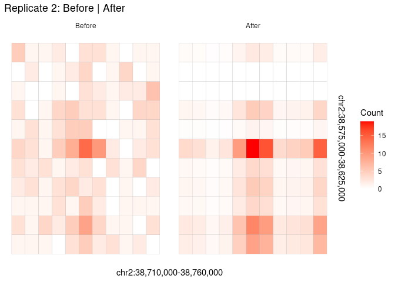
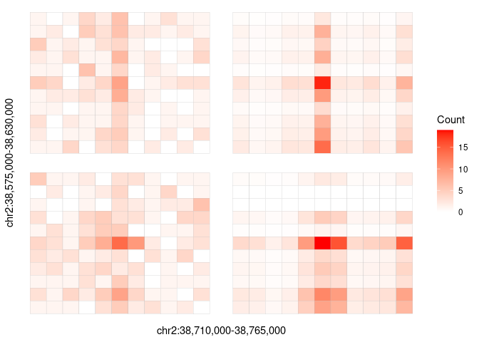
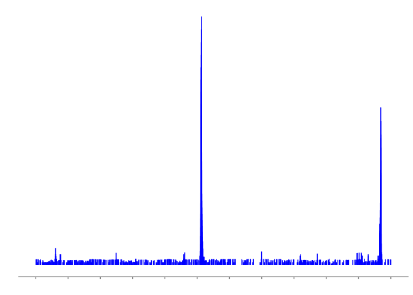

2D loop deconvolution
================

-   <a href="#loading-in-the-data" id="toc-loading-in-the-data">Loading in
    the data</a>
-   <a href="#one-loop-example" id="toc-one-loop-example">One loop
    example</a>
-   <a href="#more-examples" id="toc-more-examples">More examples</a>

This example illustrates how to do 2D loop deconvolution.

Basically, I did create some functions to automate this for many loops
over many HiChIP matrices, but I do save a lot of information (for
checking metrics like signal improvement, concordance between
replicates, etc. in the manuscript) so the objects end up being 1GB
sometimes. Could definitely make this more efficient.

The speed is pretty good, but for doing the whole genome I just did 1
job per chromosome. It can take a day for chromosome 1 if using a really
long list of loops (like merging 5-6 different loop lists).

``` r
library(data.table)
library(Matrix)
library(dplyr)
```


    Attaching package: 'dplyr'

    The following objects are masked from 'package:data.table':

        between, first, last

    The following objects are masked from 'package:stats':

        filter, lag

    The following objects are masked from 'package:base':

        intersect, setdiff, setequal, union

``` r
library(GenomicRanges)
```

    Loading required package: stats4

    Loading required package: BiocGenerics


    Attaching package: 'BiocGenerics'

    The following objects are masked from 'package:dplyr':

        combine, intersect, setdiff, union

    The following objects are masked from 'package:stats':

        IQR, mad, sd, var, xtabs

    The following objects are masked from 'package:base':

        anyDuplicated, aperm, append, as.data.frame, basename, cbind,
        colnames, dirname, do.call, duplicated, eval, evalq, Filter, Find,
        get, grep, grepl, intersect, is.unsorted, lapply, Map, mapply,
        match, mget, order, paste, pmax, pmax.int, pmin, pmin.int,
        Position, rank, rbind, Reduce, rownames, sapply, setdiff, sort,
        table, tapply, union, unique, unsplit, which.max, which.min

    Loading required package: S4Vectors


    Attaching package: 'S4Vectors'

    The following objects are masked from 'package:dplyr':

        first, rename

    The following objects are masked from 'package:Matrix':

        expand, unname

    The following objects are masked from 'package:data.table':

        first, second

    The following objects are masked from 'package:base':

        expand.grid, I, unname

    Loading required package: IRanges


    Attaching package: 'IRanges'

    The following objects are masked from 'package:dplyr':

        collapse, desc, slice

    The following object is masked from 'package:data.table':

        shift

    Loading required package: GenomeInfoDb

``` r
library(strawr)
library(rtracklayer)
library(gridExtra)
```


    Attaching package: 'gridExtra'

    The following object is masked from 'package:BiocGenerics':

        combine

    The following object is masked from 'package:dplyr':

        combine

``` r
library(cowplot)
library(ggplot2)

library(dcon)


RESOLUTION <- 5000
MIN_DIST <- 20

current_chrom<-'chr2'
```

# Loading in the data

The essential components are:

1.  HiChIP matrix or matrices representing intrachromosomal contacts
    from one chromosome at a time. Here I load them in with
    `strawr::straw` and then convert them to sparse (maybe there are
    more efficient ways). Note the indices need to be converted to
    1-based in R.
2.  Coordinates. I did create a function `dcon:::load_coords` in case
    you also make them with the `bedtools makewindows` command.
    Important: must have the `id` column which is used by the deconvolve
    function later. I just assign each window an integer in numerical
    order.
3.  HiC matrix. Loaded in the same way as the HiChIP here.
4.  Loops. Here I show using a set called by FitHiChIP. Need to work it
    into a data frame with columns `chr1, s1, e1, chr2, s2, e2`.

Other notes: \* I focused on long-range (anchor distance \>100kb) loops,
hence `MIN_DIST=20` \* I zero out the HiChIP diagonal so it doesn’t
drown out the signal from the loops

``` r
# Load hichip matrices and coordinates
chip.df <- strawr::straw("NONE", "/rafalab/lzou/hichip_gm12878/GM_HiChIP_cohesin_r1.hic", gsub('chr','',current_chrom), gsub('chr','',current_chrom), "BP", RESOLUTION)
chip.df$x <- chip.df$x/RESOLUTION
chip.df$y <- chip.df$y/RESOLUTION
chip.df <- chip.df %>% filter(y-x>3)
chip1 <- sparseMatrix(i = chip.df$x+1, j = chip.df$y+1, x = chip.df$counts)
chip.df <- strawr::straw("NONE", "/rafalab/lzou/hichip_gm12878/GM_HiChIP_cohesin_r2.hic", gsub('chr','',current_chrom), gsub('chr','',current_chrom), "BP", RESOLUTION)
chip.df$x <- chip.df$x/RESOLUTION
chip.df$y <- chip.df$y/RESOLUTION
chip.df <- chip.df %>% filter(y-x>3)
chip2 <- sparseMatrix(i = chip.df$x+1, j = chip.df$y+1, x = chip.df$counts)
coords <- dcon:::load_coords('/rafalab/lzou/resources/hg19.5kb.windows', type='windows')
coords <- coords[seqnames(coords)==current_chrom,]
coords$id <- seq(1,length(coords))
# Load in HiC matrix
hic <- strawr::straw("NONE", "/rafalab/lzou/hichip_gm12878/ENCFF718AWL.hic", gsub('chr','',current_chrom), gsub('chr','',current_chrom), "BP", RESOLUTION)
hic <- sparseMatrix(i = hic$x/RESOLUTION+1, j = hic$y/RESOLUTION+1, x = hic$counts)
# Load in loops
loops <- fread('/rafalab/lzou/hichip_gm12878/fithichip_gm12878_cohesin_loose.csv')
colnames(loops)[1:5] <- c('chr1','s1','e1','s2','e2')
loops$chr2 <- current_chrom
loops <- loops %>% filter(chr1==current_chrom)
loops <- loops %>% arrange(s1,s2)
loops$bin1 <- loops[,1:3] %>% dplyr::rename(seqnames=chr1, start=s1, end=e1) %>% left_join(as.data.frame(coords)) %>% pull(id)
```

    Joining, by = c("seqnames", "start", "end")

``` r
loops$bin2 <- loops[,c(1,4,5)] %>% dplyr::rename(seqnames=chr1, start=s2, end=e2) %>% left_join(as.data.frame(coords)) %>% pull(id)
```

    Joining, by = c("seqnames", "start", "end")

``` r
loops <- loops %>% filter(bin2-bin1>MIN_DIST)
```

# One loop example

``` r
mys1 <- 38600000
mys2 <- 38735000
myloop <- loops %>% filter(s1==mys1,s2==mys2)
myDcon_one <- Dcon(mat = list(gm12878_1=chip1, gm12878_2=chip2),
                   coords = coords,
                   loops = myloop,
                   hic = list(hic))
myDconvolved_one <- deconvolve(myDcon_one, gamma=1, save_mat = T, pad=5, df=11)
```

    Found loops - assuming that each matrix in mat is 
                          a hichip matrix

``` r
h1 <- reshape2::melt(as.matrix(myDconvolved_one@mat$before[[1]])) %>%
  mutate(type = 'Before') %>%
  rbind(reshape2::melt(as.matrix(myDconvolved_one@mat$after[[1]])) %>%
          mutate(type = 'After')) %>%
  mutate(type = factor(type, levels = c('Before','After'))) %>%
  ggplot(aes(x = Var2*5000+mys2-50000, y = Var1*5000+mys1-50000)) +
  geom_tile(aes(fill=value),color='grey') +
  scale_fill_gradient(name='Count',low='white',high='red') +
  facet_wrap( type ~ .) +
  theme_minimal() +
  theme(axis.ticks = element_blank(), axis.line.x = element_blank(), axis.line.y = element_blank(),
        panel.grid = element_blank()) +
  xlab('Anchor 1') +
  ylab('Anchor 2') + 
  scale_x_continuous(labels=NULL) +
  scale_y_continuous(labels=NULL, trans='reverse') +
  ylab(paste0('chr2:', prettyNum(mys1-2.5e4, big.mark=','), '-', prettyNum(mys1+2.5e4, big.mark=','))) +
  xlab(paste0('chr2:', prettyNum(mys2-2.5e4, big.mark=','), '-', prettyNum(mys2+2.5e4, big.mark=','))) +
  ggtitle('Replicate 1: Before | After')
h1
```


``` r
ggsave(file='gm12878_cohesin_rep1_example_loop.pdf', height=3, width=6)
```

``` r
h2 <- reshape2::melt(as.matrix(myDconvolved_one@mat$before[[2]])) %>%
  mutate(type = 'Before') %>%
  rbind(reshape2::melt(as.matrix(myDconvolved_one@mat$after[[2]])) %>%
          mutate(type = 'After')) %>%
  mutate(type = factor(type, levels = c('Before','After'))) %>%
  ggplot(aes(x = Var2*5000+mys2-50000, y = Var1*5000+mys1-50000)) +
  geom_tile(aes(fill=value),color='grey') +
  scale_fill_gradient(name='Count',low='white',high='red') +
  facet_wrap( type ~ .) +
  theme_minimal() +
  theme(axis.ticks = element_blank(), axis.line.x = element_blank(), axis.line.y = element_blank(),
        panel.grid = element_blank()) +
  xlab('Anchor 1') +
  ylab('Anchor 2') + 
  scale_x_continuous(labels=NULL) +
  scale_y_continuous(labels=NULL, trans='reverse', position = 'right') +
  ylab(paste0('chr2:', prettyNum(mys1-2.5e4, big.mark=','), '-', prettyNum(mys1+2.5e4, big.mark=','))) +
  xlab(paste0('chr2:', prettyNum(mys2-2.5e4, big.mark=','), '-', prettyNum(mys2+2.5e4, big.mark=','))) +
  ggtitle('Replicate 2: Before | After')
h2
```



``` r
ggsave(file='gm12878_cohesin_rep2_example_loop.pdf', height=3, width=6)
```

``` r
# layout in the same fig
reshape2::melt(as.matrix(myDconvolved_one@mat$before[[1]])) %>%
  mutate(type = 'Before', replicate = 'Rep 1') %>%
  rbind(reshape2::melt(as.matrix(myDconvolved_one@mat$after[[1]])) %>%
          mutate(type = 'After', replicate = 'Rep 1')) %>%
  rbind(
    reshape2::melt(as.matrix(myDconvolved_one@mat$before[[2]])) %>%
      mutate(type = 'Before', replicate = 'Rep 2') %>%
      rbind(reshape2::melt(as.matrix(myDconvolved_one@mat$after[[2]])) %>%
              mutate(type = 'After', replicate = 'Rep 2')) 
  ) %>%
  mutate(type = factor(type, levels = c('Before','After'))) %>%
  ggplot(aes(x = Var2*5000+mys2-50000, y = Var1*5000+mys1-50000)) +
  geom_tile(aes(fill=value),color='grey') +
  scale_fill_gradient(name='Count',low='white',high='red') +
  facet_wrap(replicate ~ type) +
  theme_minimal() +
  theme(axis.ticks = element_blank(), axis.line.x = element_blank(), axis.line.y = element_blank(),
        panel.grid = element_blank(), strip.text = element_blank()) +
  xlab('Anchor 1') +
  ylab('Anchor 2') + 
  scale_x_continuous(labels=NULL) +
  scale_y_continuous(labels=NULL, trans='reverse', position = 'left') +
  ylab(paste0('chr2:', prettyNum(mys1-2.5e4, big.mark=','), '-', prettyNum(mys1+3e4, big.mark=','))) +
  xlab(paste0('chr2:', prettyNum(mys2-2.5e4, big.mark=','), '-', prettyNum(mys2+3e4, big.mark=','))) 
```



``` r
ggsave('gm12878_cohesin_example_both_reps.pdf', height=6, width=7)
```

``` r
# chip-seq for that region
smc3 <- import('/rafalab/lzou/chip/ENCFF815ERA_SMC3_GM12878_hg19.bigWig')
smc3 <- smc3[seqnames(smc3)=='chr2']
smc3_r1 <- smc3[(start(smc3) >= mys1-2.5e4) & (start(smc3) <= mys1+3e4)]
smc3_r2 <- smc3[(start(smc3) >= mys2-2.5e4) & (start(smc3) <= mys2+3e4)]
```

``` r
as.data.frame(smc3_r1) %>%
  ggplot(aes(x = start, y= score)) +
  geom_bar(stat='identity',fill='blue',color='blue') +
  scale_x_continuous(breaks = seq(mys1-2.5e4, mys1+3e4, 5e3)) +
  theme_minimal() +
  theme(axis.text = element_blank(),
        axis.line.x.bottom = element_line(color = "gray 50"),
        panel.grid.major = element_blank(),
        panel.grid.minor = element_blank(),
        axis.ticks.x = element_line(color='gray 50')) +
  xlab('') +
  ylab('') +
  ylim(c(0,10))
```


``` r
ggsave('gm12878_cohesin_smc3_chipseq_example_r1.pdf', height=1, width=3.25)
```

``` r
as.data.frame(smc3_r2) %>%
  ggplot(aes(x = start, y= score)) +
  geom_bar(stat='identity',fill='blue',color='blue') +
  scale_x_continuous(breaks = seq(mys2-2.5e4, mys2+3e4, 5e3)) +
  theme_minimal() +
  theme(axis.text = element_blank(),
        axis.line.x.bottom = element_line(color = "gray 50"),
        panel.grid.major = element_blank(),
        panel.grid.minor = element_blank(),
        axis.ticks.x = element_line(color='gray 50')) +
  xlab('') +
  ylab('')
```



``` r
ggsave('gm12878_cohesin_smc3_chipseq_example_r2.pdf', height=1, width=3.75)
```

# More examples

``` r
myDcon <- Dcon(mat = list(gm12878_1=chip1, gm12878_2=chip2),
               coords = coords,
               loops = loops %>% slice(1000:1050),
               hic = list(hic))
myDcon
```

``` r
myDconvolved <- deconvolve(myDcon, df=11, gamma=0.5, save_mat = T, pad=5)
```

``` r
for (i in 1:nrow(myDconvolved@loops)) {
  lab <- paste0(paste('chr2',myDconvolved@loops$s1[i], myDconvolved@loops$s2[i], sep=':'), ', PET: ', myDconvolved@loops$pet[i])
  idx1 <- ((i-1)*2)+1
  idx2 <- i*2
  plot_mat(myDconvolved@mat$before[[idx1]], paste(lab,'before,rep1'))
  plot_mat(myDconvolved@mat$after[[idx1]], paste(lab,'after,rep1'))
  plot_mat(myDconvolved@mat$before[[idx2]], paste(lab,'before,rep2'))
  plot_mat(myDconvolved@mat$after[[idx2]], paste(lab,'after,rep2'))
}
```
