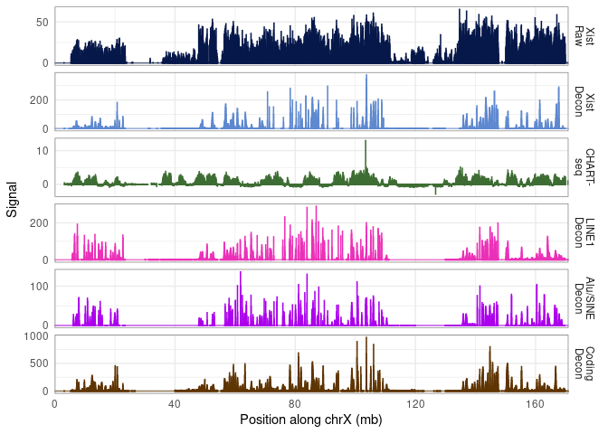

RD-SPRITE lncRNA and repeat RNA tracks
================

# chrX

## Load raw and CHART-seq

``` r
windows <- data.frame(fread('/rafalab/lzou/rdsprite/dna_matrix/mm10.10kb.windows', header=F, col.names=c('chrom','start','end')))
windows$idx <- seq(1,nrow(windows))
windows <- windows[windows$chrom=='chrX',]
windows$bin <- paste0('(',windows$start, ',', windows$end, ']')
# get the raw values chromosome wide
mol <- fread('/rafalab/lzou/rdsprite/count_windows/Xist_RNA_count_windows_10000_clusters_2-1000_chrX_129S1_SvImJ.csv')
windows$xist_raw <- as.numeric(mol$count[mol$chrom=='chrX'])
mol <- fread('/rafalab/lzou/rdsprite/count_windows/Alu,SINE|SINE,Alu_RNA_count_windows_10000_clusters_2-1000_chrX_129S1_SvImJ.csv')
windows$SINE_raw <- as.numeric(mol$count[mol$chrom=='chrX'])
mol <- fread('/rafalab/lzou/rdsprite/count_windows/L1,LINE|LINE,L1_RNA_count_windows_10000_clusters_2-1000_chrX_129S1_SvImJ.csv')
windows$LINE_raw <- as.numeric(mol$count[mol$chrom=='chrX'])
mol <- fread('/rafalab/lzou/rdsprite/count_windows/chrX_RNA_count_windows_10000_clusters_2-1000_chrX_129S1_SvImJ.csv')
windows$coding_raw <- as.numeric(mol$count[mol$chrom=='chrX'])
# load in chart-seq
d0 <- fread('/rafalab/lzou/chartseq/GSM1182888_d0.xist.comp.mm10.bedGraph', col.names = c('chrom','start','end','value')) |> filter(chrom=='chrX') |> mutate(bin = cut(start, breaks = windows$start, dig.lab = 10)) |> group_by(bin) |> summarise(d0 = mean(value))
windows <- windows |> left_join(d0)
```

    ## Joining, by = "bin"

``` r
d0 <- fread('/rafalab/lzou/chartseq/GSM1182890_d3.xist.comp.mm10.bedGraph', col.names = c('chrom','start','end','value')) |> filter(chrom=='chrX') |> mutate(bin = cut(start, breaks = windows$start, dig.lab = 10)) |> group_by(bin) |> summarise(d3 = mean(value))
windows <- windows |> left_join(d0)
```

    ## Joining, by = "bin"

``` r
d0 <- fread('/rafalab/lzou/chartseq/GSM1182892_d7.xist.comp.mm10.bedGraph', col.names = c('chrom','start','end','value')) |> filter(chrom=='chrX') |> mutate(bin = cut(start, breaks = windows$start, dig.lab = 10)) |> group_by(bin) |> summarise(d7 = mean(value))
windows <- windows |> left_join(d0)
```

    ## Joining, by = "bin"

``` r
d0 <- fread('/rafalab/lzou/chartseq/GSM1182892_d7.xist.comp.mm10.bedGraph', col.names = c('chrom','start','end','value')) |> filter(chrom=='chrX') |> mutate(bin = cut(start, breaks = windows$start, dig.lab = 10)) |> group_by(bin) |> summarise(d7 = mean(value))
windows <- windows |> left_join(d0)
```

    ## Joining, by = c("bin", "d7")

``` r
d0 <- fread('/rafalab/lzou/chartseq/GSM1216701_d10.xist.mm10.bedGraph', col.names = c('chrom','start','end','value')) |> filter(chrom=='chrX') |> mutate(bin = cut(start, breaks = windows$start, dig.lab = 10)) |> group_by(bin) |> summarise(d10 = mean(value))
windows <- windows |> left_join(d0)
```

    ## Joining, by = "bin"

``` r
d0 <- fread('/rafalab/lzou/chartseq/GSM1182875_MEF.xist.comp.mm10.bedGraph', col.names = c('chrom','start','end','value')) |> filter(chrom=='chrX') |> mutate(bin = cut(start, breaks = windows$start, dig.lab = 10)) |> group_by(bin) |> summarise(mef = mean(value))
windows <- windows |> left_join(d0)
```

    ## Joining, by = "bin"

## Load fits with dfs and gammas

### Xist

``` r
fnames <- list.files(pattern = 'Xist_.*df.*_gamma.*_clusters2-1000_fit.rds')
for (f in fnames) {
  df <- as.integer(gsub('df', '', str_extract(f, 'df[0-9]+')))
  gamma <- as.numeric(gsub('gamma','',str_extract(f, 'gamma(\\.|[0-9])+')))
  colname <- paste0('df',df,'_gamma',gamma)
  fit <- readRDS(f)
  windows[, colname] <- exp(fit$est)
}
```

``` r
windows |>
  pivot_longer(cols = starts_with('df'), names_sep='_', names_to=c('df','gamma')) |>
  mutate(df = gsub('df','',df), gamma = gsub('gamma', '',gamma)) |>
  filter(gamma != 0.999) |>
  filter(start >= 90e6, end <= 120e6) |>
  ggplot(aes(x = start/1e6, y = value)) +
  geom_point(size=0.1) +
  facet_grid(df ~ gamma) +
  geom_vline(xintercept=103467500/1e6, lty='dashed', color = 'red') +
  theme_bw() +
  xlab('position along chrX (mb)')
```

<!-- -->

``` r
ggsave('rdsprite-df-gamma-xist-facet.pdf', height=5, width=10)
```

### Stack Xist with CHART

``` r
bigdf <- bind_rows(
  data.frame(
    start = windows$start,
    value = windows$xist_raw,
    type = 'Raw RD-\nSPRITE',
    color = '#06184A'
  ),
  data.frame(
    start = windows$start,
    value = windows$df100_gamma0.25,
    type = 'Decon\ng=0.25',
    color = '#2a3658'
  ),
  data.frame(
    start = windows$start,
    value = windows$df100_gamma0.5,
    type = 'Decon\ng=0.50',
    color = '#3c507d'
  ),
  data.frame(
    start = windows$start,
    value = windows$df100_gamma0.75,
    type = 'Decon\ng=0.75',
    color = '#4e6ba5'
  ),
  data.frame(
    start = windows$start,
    value = windows$df100_gamma0.9,
    type = 'Decon\ng=0.90',
    color = '#5e88cf'
  ),
  data.frame(
    start = windows$start,
    value = windows$df100_gamma0.95,
    type = 'Decon\ng=0.95',
    color = '#5e88cf'
  ),
  data.frame(
    start = windows$start,
    value = windows$df100_gamma0.99,
    type = 'Decon\ng=0.99',
    color = '#5e88cf'
  ),
  data.frame(
    start = windows$start,
    value = windows$d0,
    type = 'CHART-\nseq d0',
    color = '#538149'
  ) |>
    mutate(value = ifelse(value < 0, 0, value)) |>
    mutate(value = ifelse(value > 10, 10, value)),
  data.frame(
    start = windows$start,
    value = windows$d3,
    type = 'CHART-\nseq d3',
    color = '#3e6d33'
  ) |>
    mutate(value = ifelse(value < 0, 0, value)) |>
    mutate(value = ifelse(value > 10, 10, value)),
  data.frame(
    start = windows$start,
    value = windows$d7,
    type = 'CHART-\nseq d7',
    color = '#28591d'
  ) |>
    mutate(value = ifelse(value < 0, 0, value)) |>
    mutate(value = ifelse(value > 10, 10, value)),
  data.frame(
    start = windows$start,
    value = windows$d10,
    type = 'CHART-\nseq d10',
    color = '#114605'
  ) |>
    mutate(value = ifelse(value < 0, 0, value)) |>
    mutate(value = ifelse(value > 10, 10, value))
)

bigdf |>
  mutate(type = factor(type, levels = c('Raw RD-\nSPRITE', 'Decon\ng=0.25', 'Decon\ng=0.50','Decon\ng=0.75','Decon\ng=0.90','Decon\ng=0.95','Decon\ng=0.99','CHART-\nseq d0','CHART-\nseq d3','CHART-\nseq d7','CHART-\nseq d10'))) |>
  ggplot(aes(x = start/1e6, y = value)) +
  geom_vline(xintercept = 103467500/1e6, color = 'red', size=0.25) +
  geom_point(aes(color=color),size=0.01) +
  facet_wrap(type ~ ., ncol = 1, scales = 'free_y',
             strip.position = 'right') +
  scale_y_continuous(breaks = pretty_breaks(n=2)) +
  scale_x_continuous(expand = c(0,0)) +
  scale_color_identity() +
  theme_minimal() +
  theme(panel.border = element_rect(color = "gray 50", fill = NA)) + 
  xlab('Position along chrX (mb)') +
  ylab('Xist lncRNA Signal')
```

    ## Warning: Using `size` aesthetic for lines was deprecated in ggplot2 3.4.0.
    ## ℹ Please use `linewidth` instead.

    ## Warning: Removed 3573 rows containing missing values (`geom_point()`).

<!-- -->

``` r
ggsave('rdsprite-chart-xist-df.pdf', height=7.25, width=6)
```

    ## Warning: Removed 3573 rows containing missing values (`geom_point()`).

### CHART-seq d3 signal histogram

``` r
windows |>
  ggplot(aes(x = d3)) +
  geom_histogram(bins=100, color='black', fill='powderblue') +
  geom_vline(xintercept=0.5, color='red') +
  theme_classic()
```

    ## Warning: Removed 892 rows containing non-finite values (`stat_bin()`).

<!-- -->

``` r
ggsave('chartseq-d3-hist.pdf', height=3, width=4)
```

    ## Warning: Removed 892 rows containing non-finite values (`stat_bin()`).

### CHART-seq d3 peaks

``` r
peaks <- import('xist_chart_d3_peaks.bed')
wins <- import('/rafalab/lzou/resources/mm10.10kb.windows', format='bed')
wins <- wins[seqnames(wins)=='chrX']
ovl <- findOverlaps(wins, peaks)
windows$peak <- 0
windows$peak[unique(queryHits(ovl))] <- 1
windows |>
  ggplot(aes(x=start/1e6, y = d3)) +
  geom_point(aes(color = factor(peak)), size=0.5) +
  scale_color_tableau(name='', breaks = c(0,1), labels = c('no peak', 'peak')) +
  theme_classic() +
  xlab('position along chrX (mb)') +
  ylab('CHART-seq d3 signal')
```

    ## Warning: Removed 892 rows containing missing values (`geom_point()`).

<!-- -->

``` r
ggsave('chartseq-d3-peaks.pdf', height=3, width=4)
```

    ## Warning: Removed 892 rows containing missing values (`geom_point()`).

## LINE, SINE, and coding genes

``` r
windows$LINE_fit_0.25 <- exp(readRDS('LINE_df100_gamma0.25_clusters2-1000_fit.rds')$est)
windows$SINE_fit_0.25 <- exp(readRDS('SINE_df100_gamma0.25_clusters2-1000_fit.rds')$est)
windows$coding_fit_0.25 <- exp(readRDS('codingX_df100_gamma0.25_clusters2-1000_fit.rds')$est)
windows$LINE_fit_0.5 <- exp(readRDS('LINE_df100_gamma0.5_clusters2-1000_fit.rds')$est)
windows$SINE_fit_0.5 <- exp(readRDS('SINE_df100_gamma0.5_clusters2-1000_fit.rds')$est)
windows$coding_fit_0.5 <- exp(readRDS('codingX_df100_gamma0.5_clusters2-1000_fit.rds')$est)
windows$LINE_fit_0.75 <- exp(readRDS('LINE_df100_gamma0.75_clusters2-1000_fit.rds')$est)
windows$SINE_fit_0.75 <- exp(readRDS('SINE_df100_gamma0.75_clusters2-1000_fit.rds')$est)
windows$coding_fit_0.75 <- exp(readRDS('codingX_df100_gamma0.75_clusters2-1000_fit.rds')$est)
windows$LINE_fit_0.9 <- exp(readRDS('LINE_df100_gamma0.9_clusters2-1000_fit.rds')$est)
windows$SINE_fit_0.9 <- exp(readRDS('SINE_df100_gamma0.9_clusters2-1000_fit.rds')$est)
windows$coding_fit_0.9 <- exp(readRDS('codingX_df100_gamma0.9_clusters2-1000_fit.rds')$est)
windows$LINE_fit_0.95 <- exp(readRDS('LINE_df100_gamma0.95_clusters2-1000_fit.rds')$est)
windows$SINE_fit_0.95 <- exp(readRDS('SINE_df100_gamma0.95_clusters2-1000_fit.rds')$est)
windows$coding_fit_0.95 <- exp(readRDS('codingX_df100_gamma0.95_clusters2-1000_fit.rds')$est)
windows$LINE_fit_0.99 <- exp(readRDS('LINE_df100_gamma0.99_clusters2-1000_fit.rds')$est)
windows$SINE_fit_0.99 <- exp(readRDS('SINE_df100_gamma0.99_clusters2-1000_fit.rds')$est)
windows$coding_fit_0.99 <- exp(readRDS('codingX_df100_gamma0.99_clusters2-1000_fit.rds')$est)
windows$LINE_fit_1 <- exp(readRDS('LINE_df100_gamma1_clusters2-1000_fit.rds')$est)
windows$SINE_fit_1 <- exp(readRDS('SINE_df100_gamma1_clusters2-1000_fit.rds')$est)
```

``` r
bigdf <- bind_rows(
  data.frame(
    start = windows$start,
    value = windows$LINE_raw,
    type = 'LINE1\nRaw',
    color = '#eb30b8'
  ),
  data.frame(
    start = windows$start,
    value = windows$LINE_fit_0.95,
    type = 'LINE1\nDecon',
    color = '#ff9cd4'
  ),
  data.frame(
    start = windows$start,
    value = windows$SINE_raw,
    type = 'Alu/SINE\nRaw',
    color = '#ac00ec'
  ),
  data.frame(
    start = windows$start,
    value = windows$SINE_fit_0.95,
    type = 'Alu/SINE\nDecon',
    color = '#ce8dec'
  ),
  data.frame(
    start = windows$start,
    value = windows$coding_raw,
    type = 'Coding\nRaw',
    color = '#5e3402'
  ),
  data.frame(
    start = windows$start,
    value = windows$coding_fit_0.95,
    type = 'Coding\nDecon',
    color = '#ae7451'
  )
)

bigdf |>
  mutate(type = factor(type, levels = c('LINE1\nRaw', 'LINE1\nDecon', 'Alu/SINE\nRaw', 'Alu/SINE\nDecon', 'Coding\nRaw', 'Coding\nDecon'))) |>
  ggplot(aes(x = start/1e6, y = value)) +
  geom_point(aes(color=color),size=0.01) +
  facet_wrap(type ~ ., ncol = 1, scales = 'free_y',
             strip.position = 'right') +
  scale_y_continuous(breaks = pretty_breaks(n=2)) +
  scale_x_continuous(expand = c(0,0), breaks = pretty_breaks(n=6)) +
  scale_color_identity() +
  theme_minimal() +
  theme(panel.border = element_rect(color = "gray 50", fill = NA)) + 
  xlab('Position along chrX (mb)') +
  ylab('Signal')
```

<!-- -->

``` r
ggsave('rdsprite-line-sine-coding-track-chrX.pdf', height=4.25, width=6)
```

## Subset for main figure

``` r
bigdf <- bind_rows(
  data.frame(
    start = windows$start,
    value = windows$xist_raw,
    type = 'Xist\nRaw',
    color = '#06184A'
  ),
  data.frame(
    start = windows$start,
    value = windows$df100_gamma0.95,
    type = 'Xist\nDecon',
    color = '#5e88cf'
  ),
  data.frame(
    start = windows$start,
    value = windows$d3,
    type = 'CHART-\nseq',
    color = '#3e6d33'
  ),
  data.frame(
    start = windows$start,
    value = windows$LINE_fit_0.95,
    type = 'LINE1\nDecon',
    color = '#eb30b8'
  ),
  data.frame(
    start = windows$start,
    value = windows$SINE_fit_0.95,
    type = 'Alu/SINE\nDecon',
    color = '#ac00ec'
  ),
  data.frame(
    start = windows$start,
    value = windows$coding_fit_0.95,
    type = 'Coding\nDecon',
    color = '#5e3402'
  )
)

bigdf |>
  mutate(type = factor(type, levels = c('Xist\nRaw', 'Xist\nDecon','CHART-\nseq', 'LINE1\nDecon', 'Alu/SINE\nDecon', 'Coding\nDecon'))) |>
  ggplot(aes(x = start/1e6, y = value)) +
  geom_vline(xintercept = 103467500/1e6, color = 'red', size=0.25) +
  geom_point(aes(color=color),size=0.01) +
  facet_wrap(type ~ ., ncol = 1, scales = 'free_y',
             strip.position = 'right') +
  scale_y_continuous(breaks = pretty_breaks(n=2)) +
  scale_x_continuous(expand = c(0,0)) +
  scale_color_identity() +
  theme_minimal() +
  theme(panel.border = element_rect(color = "gray 50", fill = NA)) + 
  xlab('Position along chrX (mb)') +
  ylab('Signal')
```

    ## Warning: Removed 892 rows containing missing values (`geom_point()`).

<!-- -->

``` r
ggsave('rdsprite-chart-xist-df-subset.pdf', height=4.25, width=6)
```

    ## Warning: Removed 892 rows containing missing values (`geom_point()`).

## IGV-like

``` r
bigdf |>
  mutate(bin = cut(start, breaks = seq(0,max(bigdf$start),5e4), labels = seq(0,max(bigdf$start)-5e4,5e4),include.lowest=T)) |>
  group_by(bin,type,color) |>
  summarise(value = mean(value)) |>
  mutate(bin = as.numeric(as.character(bin))) |>
  mutate(type = factor(type, levels = c('Xist\nRaw', 'Xist\nDecon','CHART-\nseq', 'LINE1\nDecon', 'Alu/SINE\nDecon', 'Coding\nDecon'))) |>
  ggplot(aes(x = bin/1e6, y = value)) +
  geom_vline(xintercept = 103467500/1e6, color = 'red', size=0.25) +
  geom_bar(aes(color=color,fill=color),stat='identity') +
  facet_wrap(type ~ ., ncol = 1, scales = 'free_y',
             strip.position = 'right') +
  scale_y_continuous(breaks = pretty_breaks(n=2)) +
  scale_x_continuous(expand = c(0,0)) +
  scale_color_identity() +
  scale_fill_identity() +
  theme_minimal() +
  theme(panel.border = element_rect(color = "gray 50", fill = NA)) + 
  xlab('Position along chrX (mb)') +
  ylab('Signal')
```

    ## `summarise()` has grouped output by 'bin', 'type'. You can override using the
    ## `.groups` argument.

    ## Warning: Removed 213 rows containing missing values (`position_stack()`).

<!-- -->

``` r
ggsave('rdsprite-IGV-chart-xist-df-subset.pdf', height=4.25, width=6)
```

    ## Warning: Removed 213 rows containing missing values (`position_stack()`).

## Percent of signal in peaks

``` r
percsig <- windows |>
  group_by(peak) |>
  summarise(xist_raw = sum(xist_raw), xist_g0.25 = sum(df100_gamma0.25), xist_g0.50 = sum(df100_gamma0.5), xist_g0.75 = sum(df100_gamma0.75), xist_g0.90 = sum(df100_gamma0.9), xist_g0.95 = sum(df100_gamma0.95), xist_g0.99 = sum(df100_gamma0.99), xist_g1 = sum(df100_gamma1),   
            LINE_raw = sum(LINE_raw), LINE_g0.25 = sum(LINE_fit_0.25), LINE_g0.50 = sum(LINE_fit_0.5), LINE_g0.75 = sum(LINE_fit_0.75), LINE_g0.90 = sum(LINE_fit_0.9), LINE_g0.95 = sum(LINE_fit_0.95), LINE_g0.99 = sum(LINE_fit_0.99), LINE_g1 = sum(LINE_fit_1),
            SINE_raw = sum(SINE_raw), SINE_g0.25 = sum(SINE_fit_0.25), SINE_g0.50 = sum(SINE_fit_0.5), SINE_g0.75 = sum(SINE_fit_0.75), SINE_g0.90 = sum(SINE_fit_0.9), SINE_g0.95 = sum(SINE_fit_0.95), SINE_g0.99 = sum(SINE_fit_0.99), SINE_g1 = sum(SINE_fit_1),
            coding_raw = sum(coding_raw), coding_g0.25 = sum(coding_fit_0.25), coding_g0.50 = sum(coding_fit_0.5), coding_g0.75 = sum(coding_fit_0.75), coding_g0.90 = sum(coding_fit_0.9), coding_g0.95 = sum(coding_fit_0.95), coding_g0.99 = sum(coding_fit_0.99))
percsig$xist_raw <- percsig$xist_raw/sum(windows$xist_raw)
percsig$xist_g0.25 <- percsig$xist_g0.25/sum(windows$df100_gamma0.25)
percsig$xist_g0.50 <- percsig$xist_g0.50/sum(windows$df100_gamma0.5)
percsig$xist_g0.75 <- percsig$xist_g0.75/sum(windows$df100_gamma0.75)
percsig$xist_g0.90 <- percsig$xist_g0.90/sum(windows$df100_gamma0.9)
percsig$xist_g0.95 <- percsig$xist_g0.95/sum(windows$df100_gamma0.95)
percsig$xist_g0.99 <- percsig$xist_g0.99/sum(windows$df100_gamma0.99)
percsig$xist_g1 <- percsig$xist_g1/sum(windows$df100_gamma1)
percsig$LINE_raw <- percsig$LINE_raw/sum(windows$LINE_raw)
percsig$LINE_g0.25 <- percsig$LINE_g0.25/sum(windows$LINE_fit_0.25)
percsig$LINE_g0.50 <- percsig$LINE_g0.50/sum(windows$LINE_fit_0.5)
percsig$LINE_g0.75 <- percsig$LINE_g0.75/sum(windows$LINE_fit_0.75)
percsig$LINE_g0.90 <- percsig$LINE_g0.90/sum(windows$LINE_fit_0.9)
percsig$LINE_g0.95 <- percsig$LINE_g0.95/sum(windows$LINE_fit_0.95)
percsig$LINE_g0.99 <- percsig$LINE_g0.99/sum(windows$LINE_fit_0.99)
percsig$LINE_g1 <- percsig$LINE_g1/sum(windows$LINE_fit_1)
percsig$SINE_raw <- percsig$SINE_raw/sum(windows$SINE_raw)
percsig$SINE_g0.25 <- percsig$SINE_g0.25/sum(windows$SINE_fit_0.25)
percsig$SINE_g0.50 <- percsig$SINE_g0.50/sum(windows$SINE_fit_0.5)
percsig$SINE_g0.75 <- percsig$SINE_g0.75/sum(windows$SINE_fit_0.75)
percsig$SINE_g0.90 <- percsig$SINE_g0.90/sum(windows$SINE_fit_0.9)
percsig$SINE_g0.95 <- percsig$SINE_g0.95/sum(windows$SINE_fit_0.95)
percsig$SINE_g0.99 <- percsig$SINE_g0.99/sum(windows$SINE_fit_0.99)
percsig$SINE_g1 <- percsig$SINE_g1/sum(windows$SINE_fit_1)
percsig$coding_raw <- percsig$coding_raw/sum(windows$coding_raw)
percsig$coding_g0.25 <- percsig$coding_g0.25/sum(windows$coding_fit_0.25)
percsig$coding_g0.50 <- percsig$coding_g0.50/sum(windows$coding_fit_0.5)
percsig$coding_g0.75 <- percsig$coding_g0.75/sum(windows$coding_fit_0.75)
percsig$coding_g0.90 <- percsig$coding_g0.90/sum(windows$coding_fit_0.9)
percsig$coding_g0.95 <- percsig$coding_g0.95/sum(windows$coding_fit_0.95)
percsig$coding_g0.99 <- percsig$coding_g0.99/sum(windows$coding_fit_0.99)

percsig <- t(percsig[2,2:ncol(percsig)])


data.frame(
  label = rownames(percsig),
  perc = percsig[,1]
) |>
  tidyr::separate(label, into = c('mol', 'type'), sep='_') |>
  mutate(color = case_when(
    mol == 'xist' ~ '#5e88cf',
    mol == 'LINE' ~ '#eb30b8',
    mol == 'SINE' ~ '#ac00ec',
    mol == 'coding' ~ '#5e3402'
  )) |>
  filter(!type %in% c('g0.99', 'g1')) |>
  mutate(type = factor(type, levels = c('raw', 'g0.25', 'g0.50', 'g0.75','g0.90', 'g0.95'))) |>
  ggplot(aes(x = type, y = perc)) +
  geom_point(aes(color=color)) +
  geom_line(aes(color=color, group=color)) +
  theme_classic() +
  scale_x_discrete(breaks = c('raw', 'g0.25', 'g0.50', 'g0.75', 'g0.90','g0.95'), labels = c('Raw RD-\nSPRITE', 'g=0.25', 'g=0.50', 'g=0.75', 'g=0.90', 'g=0.95')) +
  scale_color_identity() +
  theme(axis.text.x = element_text(angle=90, hjust=1)) +
  ylab('Fraction of chrX signal in \nCHART-seq peaks') +
  xlab('')
```

<!-- -->

``` r
ggsave('rdsprite-fraction-xist-in-chart.pdf', height=3, width=3)
```

# chr7

## Load all

``` r
windows <- data.frame(fread('/rafalab/lzou/rdsprite/dna_matrix/mm10.10kb.windows', header=F, col.names=c('chrom','start','end')))
windows$idx <- seq(1,nrow(windows))
windows <- windows[windows$chrom=='chr7',]
# get the raw values chromosome wide
mol <- fread('/rafalab/lzou/rdsprite/count_windows/Kcnq1ot1_RNA_count_windows_10000_clusters_2-1000_chr7_129S1_SvImJ.csv')
windows$kcnq1ot1_raw <- as.numeric(mol$count[mol$chrom=='chr7'])
mol <- fread('/rafalab/lzou/rdsprite/count_windows/Alu,SINE|SINE,Alu_RNA_count_windows_10000_clusters_2-1000_chr7_129S1_SvImJ.csv')
windows$SINE_raw <- as.numeric(mol$count[mol$chrom=='chr7'])
mol <- fread('/rafalab/lzou/rdsprite/count_windows/L1,LINE|LINE,L1_RNA_count_windows_10000_clusters_2-1000_chr7_129S1_SvImJ.csv')
windows$LINE_raw <- as.numeric(mol$count[mol$chrom=='chr7'])
mol <- fread('/rafalab/lzou/rdsprite/count_windows/chr7_RNA_count_windows_10000_clusters_2-1000_chr7_129S1_SvImJ.csv')
windows$coding_raw <- as.numeric(mol$count[mol$chrom=='chr7'])
windows$LINE_fit <- exp(readRDS('LINE_chr7_df100_gamma0.9_fit.rds')$est)
windows$SINE_fit <- exp(readRDS('SINE_chr7_df100_gamma0.9_fit.rds')$est)
windows$coding_fit <- exp(readRDS('coding_chr7_df100_gamma0.9_fit.rds')$est)
windows$g0.25 <- exp(readRDS('Kcnq1ot1_chr7_df100_gamma0.25_fit.rds')$est)
windows$g0.5 <- exp(readRDS('Kcnq1ot1_chr7_df100_gamma0.5_fit.rds')$est)
windows$g0.75 <- exp(readRDS('Kcnq1ot1_chr7_df100_gamma0.75_fit.rds')$est)
windows$g0.9 <- exp(readRDS('Kcnq1ot1_chr7_df100_gamma0.9_fit.rds')$est)
windows$g0.95 <- exp(readRDS('Kcnq1ot1_chr7_df100_gamma0.95_fit.rds')$est)
windows$g0.99 <- exp(readRDS('Kcnq1ot1_chr7_df100_gamma0.99_fit.rds')$est)
```

## Kcnq1ot1

``` r
bigdf <- bind_rows(
  data.frame(
    start = windows$start,
    value = windows$kcnq1ot1_raw,
    type = 'Raw RD-\nSPRITE',
    color = '#06184A'
  ),
  data.frame(
    start = windows$start,
    value = windows$g0.25,
    type = 'Decon\ng=0.25',
    color = '#2a3658'
  ),
  data.frame(
    start = windows$start,
    value = windows$g0.5,
    type = 'Decon\ng=0.50',
    color = '#3c507d'
  ),
  data.frame(
    start = windows$start,
    value = windows$g0.75,
    type = 'Decon\ng=0.75',
    color = '#4e6ba5'
  ),
  data.frame(
    start = windows$start,
    value = windows$g0.9,
    type = 'Decon\ng=0.90',
    color = '#5e88cf'
  ),
  data.frame(
    start = windows$start,
    value = windows$g0.95,
    type = 'Decon\ng=0.95',
    color = '#5e88cf'
  ),
  data.frame(
    start = windows$start,
    value = windows$g0.99,
    type = 'Decon\ng=0.99',
    color = '#5e88cf'
  )
)

bigdf |>
  mutate(type = factor(type, levels = c('Raw RD-\nSPRITE','Decon\ng=0.25','Decon\ng=0.50','Decon\ng=0.75','Decon\ng=0.90','Decon\ng=0.95','Decon\ng=0.99'))) |>
  ggplot(aes(x = start/1e6, y = value)) +
  geom_vline(xintercept = 143250000/1e6, color = 'red', size=0.25) +
  geom_point(aes(color=color),size=0.01) +
  facet_wrap(type ~ ., ncol = 1, scales = 'free_y',
             strip.position = 'right') +
  scale_y_continuous(breaks = pretty_breaks(n=2)) +
  scale_x_continuous(expand = c(0,0), breaks = pretty_breaks(n=6)) +
  scale_color_identity() +
  theme_minimal() +
  theme(panel.border = element_rect(color = "gray 50", fill = NA)) + 
  xlab('Position along chr7 (mb)') +
  ylab('Kcnq1ot1 lncRNA Signal')
```

<!-- -->

``` r
ggsave('rdsprite-kcnq1ot1-df.pdf', height=3.75, width=6)
```

## LINE, SINE, and coding genes

``` r
windows$LINE_fit_0.25 <- exp(readRDS('LINE_chr7_df100_gamma0.25_fit.rds')$est)
windows$SINE_fit_0.25 <- exp(readRDS('SINE_chr7_df100_gamma0.25_fit.rds')$est)
windows$coding_fit_0.25 <- exp(readRDS('coding_chr7_df100_gamma0.25_fit.rds')$est)
windows$LINE_fit_0.5 <- exp(readRDS('LINE_chr7_df100_gamma0.5_fit.rds')$est)
windows$SINE_fit_0.5 <- exp(readRDS('SINE_chr7_df100_gamma0.5_fit.rds')$est)
windows$coding_fit_0.5 <- exp(readRDS('coding_chr7_df100_gamma0.5_fit.rds')$est)
windows$LINE_fit_0.75 <- exp(readRDS('LINE_chr7_df100_gamma0.75_fit.rds')$est)
windows$SINE_fit_0.75 <- exp(readRDS('SINE_chr7_df100_gamma0.75_fit.rds')$est)
windows$coding_fit_0.75 <- exp(readRDS('coding_chr7_df100_gamma0.75_fit.rds')$est)
windows$LINE_fit_0.9 <- exp(readRDS('LINE_chr7_df100_gamma0.9_fit.rds')$est)
windows$SINE_fit_0.9 <- exp(readRDS('SINE_chr7_df100_gamma0.9_fit.rds')$est)
windows$coding_fit_0.9 <- exp(readRDS('coding_chr7_df100_gamma0.9_fit.rds')$est)
windows$LINE_fit_0.95 <- exp(readRDS('LINE_chr7_df100_gamma0.95_fit.rds')$est)
windows$SINE_fit_0.95 <- exp(readRDS('SINE_chr7_df100_gamma0.95_fit.rds')$est)
windows$coding_fit_0.95 <- exp(readRDS('coding_chr7_df100_gamma0.95_fit.rds')$est)
windows$LINE_fit_0.99 <- exp(readRDS('LINE_chr7_df100_gamma0.99_fit.rds')$est)
windows$SINE_fit_0.99 <- exp(readRDS('SINE_chr7_df100_gamma0.99_fit.rds')$est)
windows$coding_fit_0.99 <- exp(readRDS('coding_chr7_df100_gamma0.99_fit.rds')$est)
```

``` r
bigdf <- bind_rows(
  data.frame(
    start = windows$start,
    value = windows$LINE_raw,
    type = 'LINE1\nRaw',
    color = '#eb30b8'
  ),
  data.frame(
    start = windows$start,
    value = windows$LINE_fit_0.95,
    type = 'LINE1\nDecon',
    color = '#ff9cd4'
  ),
  data.frame(
    start = windows$start,
    value = windows$SINE_raw,
    type = 'Alu/SINE\nRaw',
    color = '#ac00ec'
  ),
  data.frame(
    start = windows$start,
    value = windows$SINE_fit_0.95,
    type = 'Alu/SINE\nDecon',
    color = '#ce8dec'
  ),
  data.frame(
    start = windows$start,
    value = windows$coding_raw,
    type = 'Coding\nRaw',
    color = '#5e3402'
  ),
  data.frame(
    start = windows$start,
    value = windows$coding_fit_0.95,
    type = 'Coding\nDecon',
    color = '#ae7451'
  )
)

bigdf |>
  mutate(type = factor(type, levels = c('LINE1\nRaw', 'LINE1\nDecon', 'Alu/SINE\nRaw', 'Alu/SINE\nDecon', 'Coding\nRaw', 'Coding\nDecon'))) |>
  ggplot(aes(x = start/1e6, y = value)) +
  geom_point(aes(color=color),size=0.01) +
  facet_wrap(type ~ ., ncol = 1, scales = 'free_y',
             strip.position = 'right') +
  scale_y_continuous(breaks = pretty_breaks(n=2)) +
  scale_x_continuous(expand = c(0,0), breaks = pretty_breaks(n=6)) +
  scale_color_identity() +
  theme_minimal() +
  theme(panel.border = element_rect(color = "gray 50", fill = NA)) + 
  xlab('Position along chr7 (mb)') +
  ylab('Signal')
```

<!-- -->

``` r
ggsave('rdsprite-line-sine-coding-track-chr7.pdf', height=4.25, width=6)
```

## Subset for main figure

``` r
bigdf <- bind_rows(
  data.frame(
    start = windows$start,
    value = windows$kcnq1ot1_raw,
    type = 'Kcnq1ot1\nRaw',
    color = '#06184A'
  ),
  data.frame(
    start = windows$start,
    value = windows$g0.95,
    type = 'Kcnq1ot1\nDecon',
    color = '#5e88cf'
  ),
  data.frame(
    start = windows$start,
    value = windows$LINE_fit_0.95,
    type = 'LINE1\nDecon',
    color = '#eb30b8'
  ),
  data.frame(
    start = windows$start,
    value = windows$SINE_fit_0.95,
    type = 'Alu/SINE\nDecon',
    color = '#ac00ec'
  ),
  data.frame(
    start = windows$start,
    value = windows$coding_fit_0.95,
    type = 'Coding\nDecon',
    color = '#5e3402'
  )
)

bigdf |>
  mutate(type = factor(type, levels = c('Kcnq1ot1\nRaw', 'Kcnq1ot1\nDecon','LINE1\nDecon', 'Alu/SINE\nDecon', 'Coding\nDecon'))) |>
  ggplot(aes(x = start/1e6, y = value)) +
  geom_vline(xintercept = 143250000/1e6, color = 'red', size=0.25) +
  geom_point(aes(color=color),size=0.01) +
  facet_wrap(type ~ ., ncol = 1, scales = 'free_y',
             strip.position = 'right') +
  scale_y_continuous(breaks = pretty_breaks(n=2)) +
  scale_x_continuous(expand = c(0,0)) +
  scale_color_identity() +
  theme_minimal() +
  theme(panel.border = element_rect(color = "gray 50", fill = NA)) + 
  xlab('Position along chr7 (mb)') +
  ylab('Signal')
```

<!-- -->

``` r
ggsave('rdsprite-kcnq1ot1-df-subset.pdf', height=4.25, width=6)
```

## IGV-like

``` r
bigdf |>
  mutate(bin = cut(start, breaks = seq(0,max(bigdf$start),10e4), labels = seq(0,max(bigdf$start)-10e4,10e4),include.lowest=T)) |>
  group_by(bin,type,color) |>
  summarise(value = mean(value)) |>
  mutate(bin = as.numeric(as.character(bin))) |>
  mutate(type = factor(type, levels = c('Kcnq1ot1\nRaw', 'Kcnq1ot1\nDecon','CHART-\nseq', 'LINE1\nDecon', 'Alu/SINE\nDecon', 'Coding\nDecon'))) |>
  ggplot(aes(x = bin/1e6, y = value)) +
  geom_vline(xintercept = 143250000/1e6, color = 'red', size=0.25) +
  geom_bar(aes(color=color,fill=color),stat='identity') +
  facet_wrap(type ~ ., ncol = 1, scales = 'free_y',
             strip.position = 'right') +
  scale_y_continuous(breaks = pretty_breaks(n=2)) +
  scale_x_continuous(expand = c(0,0)) +
  scale_color_identity() +
  scale_fill_identity() +
  theme_minimal() +
  theme(panel.border = element_rect(color = "gray 50", fill = NA)) + 
  xlab('Position along chr7 (mb)') +
  ylab('')
```

    ## `summarise()` has grouped output by 'bin', 'type'. You can override using the
    ## `.groups` argument.

    ## Warning: Removed 5 rows containing missing values (`position_stack()`).

<!-- -->

``` r
ggsave('rdsprite-IGV-kcnq1ot1-df-subset.pdf', height=4.25, width=6)
```

    ## Warning: Removed 5 rows containing missing values (`position_stack()`).

## Percent of signal in domain

``` r
percsig <- windows |>
  mutate(domain = ifelse(start>=142750000 & end <= 143750000, 'domain', 'not domain')) |>
  group_by(domain) |>
  summarise(kcnq1ot1_raw = sum(kcnq1ot1_raw), kcnq1ot1_g0.25 = sum(g0.25), kcnq1ot1_g0.50 = sum(g0.5), kcnq1ot1_g0.75 = sum(g0.75), kcnq1ot1_g0.90 = sum(g0.9), kcnq1ot1_g0.95 = sum(g0.95), 
            LINE_raw = sum(LINE_raw), LINE_g0.25 = sum(LINE_fit_0.25), LINE_g0.50 = sum(LINE_fit_0.5), LINE_g0.75 = sum(LINE_fit_0.75), LINE_g0.90 = sum(LINE_fit_0.9), LINE_g0.95 = sum(LINE_fit_0.95), 
            SINE_raw = sum(SINE_raw), SINE_g0.25 = sum(SINE_fit_0.25), SINE_g0.50 = sum(SINE_fit_0.5), SINE_g0.75 = sum(SINE_fit_0.75), SINE_g0.90 = sum(SINE_fit_0.9), SINE_g0.95 = sum(SINE_fit_0.95),
            coding_raw = sum(coding_raw), coding_g0.25 = sum(coding_fit_0.25), coding_g0.50 = sum(coding_fit_0.5), coding_g0.75 = sum(coding_fit_0.75), coding_g0.90 = sum(coding_fit_0.9), coding_g0.95 = sum(coding_fit_0.95))
percsig$kcnq1ot1_raw <- percsig$kcnq1ot1_raw/sum(windows$kcnq1ot1_raw)
percsig$kcnq1ot1_g0.25 <- percsig$kcnq1ot1_g0.25/sum(windows$g0.25)
percsig$kcnq1ot1_g0.50 <- percsig$kcnq1ot1_g0.50/sum(windows$g0.5)
percsig$kcnq1ot1_g0.75 <- percsig$kcnq1ot1_g0.75/sum(windows$g0.75)
percsig$kcnq1ot1_g0.90 <- percsig$kcnq1ot1_g0.90/sum(windows$g0.9)
percsig$kcnq1ot1_g0.95 <- percsig$kcnq1ot1_g0.95/sum(windows$g0.95)
percsig$LINE_raw <- percsig$LINE_raw/sum(windows$LINE_raw)
percsig$LINE_g0.25 <- percsig$LINE_g0.25/sum(windows$LINE_fit_0.25)
percsig$LINE_g0.50 <- percsig$LINE_g0.50/sum(windows$LINE_fit_0.5)
percsig$LINE_g0.75 <- percsig$LINE_g0.75/sum(windows$LINE_fit_0.75)
percsig$LINE_g0.90 <- percsig$LINE_g0.90/sum(windows$LINE_fit_0.9)
percsig$LINE_g0.95 <- percsig$LINE_g0.95/sum(windows$LINE_fit_0.95)
percsig$SINE_raw <- percsig$SINE_raw/sum(windows$SINE_raw)
percsig$SINE_g0.25 <- percsig$SINE_g0.25/sum(windows$SINE_fit_0.25)
percsig$SINE_g0.50 <- percsig$SINE_g0.50/sum(windows$SINE_fit_0.5)
percsig$SINE_g0.75 <- percsig$SINE_g0.75/sum(windows$SINE_fit_0.75)
percsig$SINE_g0.90 <- percsig$SINE_g0.90/sum(windows$SINE_fit_0.9)
percsig$SINE_g0.95 <- percsig$SINE_g0.95/sum(windows$SINE_fit_0.95)
percsig$coding_raw <- percsig$coding_raw/sum(windows$coding_raw)
percsig$coding_g0.25 <- percsig$coding_g0.25/sum(windows$coding_fit_0.25)
percsig$coding_g0.50 <- percsig$coding_g0.50/sum(windows$coding_fit_0.5)
percsig$coding_g0.75 <- percsig$coding_g0.75/sum(windows$coding_fit_0.75)
percsig$coding_g0.90 <- percsig$coding_g0.90/sum(windows$coding_fit_0.9)
percsig$coding_g0.95 <- percsig$coding_g0.95/sum(windows$coding_fit_0.95)

percsig <- t(percsig[1,2:ncol(percsig)])


data.frame(
  label = rownames(percsig),
  perc = percsig[,1]
) |>
  tidyr::separate(label, into = c('mol', 'type'), sep='_') |>
  mutate(color = case_when(
    mol == 'kcnq1ot1' ~ '#5e88cf',
    mol == 'LINE' ~ '#eb30b8',
    mol == 'SINE' ~ '#ac00ec',
    mol == 'coding' ~ '#5e3402'
  )) |>
  mutate(type = factor(type, levels = c('raw', 'g0.25', 'g0.50', 'g0.75','g0.90','g0.95'))) |>
  ggplot(aes(x = type, y = perc)) +
  geom_point(aes(color=color)) +
  geom_line(aes(color=color, group=color)) +
  theme_classic() +
  scale_x_discrete(breaks = c('raw', 'g0.25', 'g0.50', 'g0.75','g0.90','g0.95'), labels = c('Raw RD-\nSPRITE', 'g=0.25', 'g=0.50', 'g=0.75', 'g=0.90', 'g=0.95')) +
  scale_color_identity() +
  theme(axis.text.x = element_text(angle=90, hjust=1)) +
  ylab('Fraction of chr7 signal in \nKcnq1ot1 imprinted domain') +
  xlab('')
```

<!-- -->

``` r
ggsave('rdsprite-fraction-kcnq1ot1-in-domain.pdf', height=3, width=3)
```

## Signal by chromatin state

``` r
chromstates <- fread('/rafalab/lzou/resources/mm10.10kb.windows.chromatin.states.bed', col.names = c('chrom','start','end','cschrom','csstart','csend','state','idk1','idk2','idk3','idk4','idk5','ovl')) |>
  filter(chrom=='chr7') |>
  mutate(activity = case_when(
    grepl('Pr-', state) ~ 4,
    grepl('En-', state) ~ 3,
    grepl('Tr-', state) ~ 2,
    T ~ 1
  )) |>
  group_by(chrom, start, end) |>
  summarise(activity = max(activity))
```

    ## `summarise()` has grouped output by 'chrom', 'start'. You can override using
    ## the `.groups` argument.

``` r
windows$activity <- chromstates$activity

percsig <- windows |>
  group_by(activity) |>
  summarise(LINE_raw = sum(LINE_raw), LINE_g0.25 = sum(LINE_fit_0.25), LINE_g0.50 = sum(LINE_fit_0.5), LINE_g0.75 = sum(LINE_fit_0.75), LINE_g0.90 = sum(LINE_fit_0.9), LINE_g0.95 = sum(LINE_fit_0.95), 
            SINE_raw = sum(SINE_raw), SINE_g0.25 = sum(SINE_fit_0.25), SINE_g0.50 = sum(SINE_fit_0.5), SINE_g0.75 = sum(SINE_fit_0.75), SINE_g0.90 = sum(SINE_fit_0.9), SINE_g0.95 = sum(SINE_fit_0.95), 
            coding_raw = sum(coding_raw), coding_g0.25 = sum(coding_fit_0.25), coding_g0.50 = sum(coding_fit_0.5), coding_g0.75 = sum(coding_fit_0.75), coding_g0.90 = sum(coding_fit_0.9), coding_g0.95 = sum(coding_fit_0.95))
percsig$LINE_raw <- percsig$LINE_raw/sum(windows$LINE_raw)
percsig$LINE_g0.25 <- percsig$LINE_g0.25/sum(windows$LINE_fit_0.25)
percsig$LINE_g0.50 <- percsig$LINE_g0.50/sum(windows$LINE_fit_0.5)
percsig$LINE_g0.75 <- percsig$LINE_g0.75/sum(windows$LINE_fit_0.75)
percsig$LINE_g0.90 <- percsig$LINE_g0.90/sum(windows$LINE_fit_0.9)
percsig$LINE_g0.95 <- percsig$LINE_g0.95/sum(windows$LINE_fit_0.95)
percsig$SINE_raw <- percsig$SINE_raw/sum(windows$SINE_raw)
percsig$SINE_g0.25 <- percsig$SINE_g0.25/sum(windows$SINE_fit_0.25)
percsig$SINE_g0.50 <- percsig$SINE_g0.50/sum(windows$SINE_fit_0.5)
percsig$SINE_g0.75 <- percsig$SINE_g0.75/sum(windows$SINE_fit_0.75)
percsig$SINE_g0.90 <- percsig$SINE_g0.90/sum(windows$SINE_fit_0.9)
percsig$SINE_g0.95 <- percsig$SINE_g0.95/sum(windows$SINE_fit_0.95)
percsig$coding_raw <- percsig$coding_raw/sum(windows$coding_raw)
percsig$coding_g0.25 <- percsig$coding_g0.25/sum(windows$coding_fit_0.25)
percsig$coding_g0.50 <- percsig$coding_g0.50/sum(windows$coding_fit_0.5)
percsig$coding_g0.75 <- percsig$coding_g0.75/sum(windows$coding_fit_0.75)
percsig$coding_g0.90 <- percsig$coding_g0.90/sum(windows$coding_fit_0.9)
percsig$coding_g0.95 <- percsig$coding_g0.95/sum(windows$coding_fit_0.95)

percsig <- t(percsig[,2:ncol(percsig)])

data.frame(
  label = rownames(percsig),
  promoter = percsig[,4],
  enhancer = percsig[,3],
  transcription = percsig[,2],
  heterochromatin = percsig[,1]
) |>
  tidyr::separate(label, into = c('mol', 'type'), sep='_') |>
  mutate(color = case_when(
    mol == 'LINE' ~ '#eb30b8',
    mol == 'SINE' ~ '#ac00ec',
    mol == 'coding' ~ '#5e3402'
  )) |>
  mutate(type = factor(type, levels = c('raw', 'g0.25', 'g0.50', 'g0.75', 'g0.90', 'g0.95'))) |>
  pivot_longer(cols = c(transcription, heterochromatin), names_to = 'chromatin_state', values_to = 'perc') |>
  mutate(chromatin_state = ifelse(chromatin_state=='transcription', 'Transcriptional', 'Heterochromatin')) |>
  mutate(chromatin_state = factor(chromatin_state, levels = c('Transcriptional', 'Heterochromatin'))) |>
  ggplot(aes(x = type, y = perc)) +
  geom_point(aes(color=color)) +
  geom_line(aes(color=color,group=color)) +
  scale_color_identity() +
  scale_x_discrete(breaks = c('raw', 'g0.25', 'g0.50', 'g0.75','g0.90','g0.95'), labels = c('Raw RD-\nSPRITE', 'g=0.25', 'g=0.50', 'g=0.75', 'g=0.90','g=0.95')) +
  scale_y_continuous(breaks = pretty_breaks(n=3)) +
  facet_wrap(chromatin_state ~ ., nrow = 1, scales='free_y') +
  theme_minimal() +
  theme(axis.text.x = element_text(angle=90, hjust=1),
        axis.line = element_line(),
        panel.grid.major = element_blank(),
        panel.grid.minor = element_blank(),
        axis.ticks = element_line()) +
  ylab('Fraction of chr7 signal\nby chromatin state') +
  xlab('')
```

<!-- -->

``` r
ggsave('rdsprite-chr7-transcriptional-heterochromatin.pdf', height=3, width=6)
```
