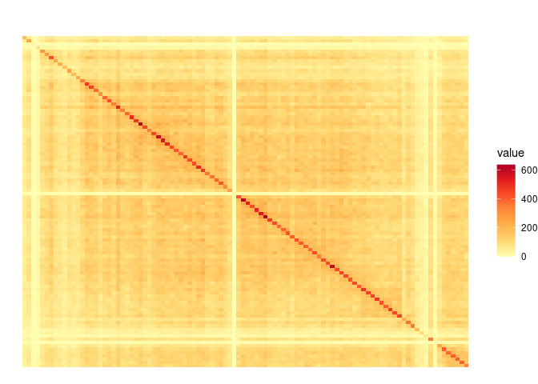
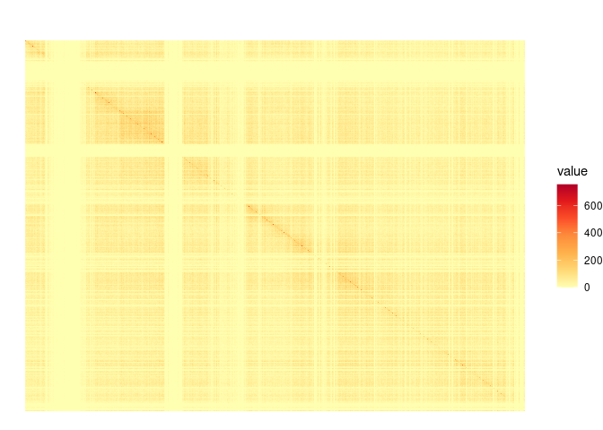
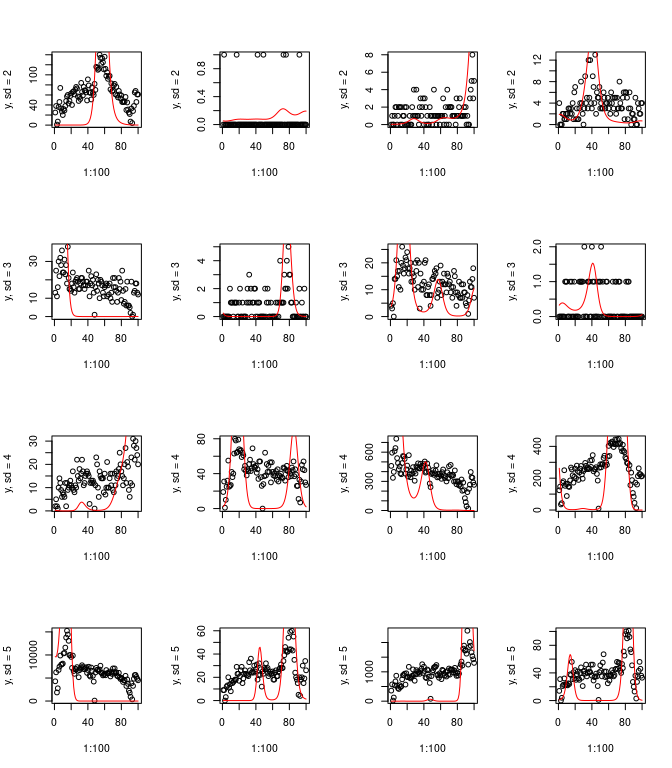
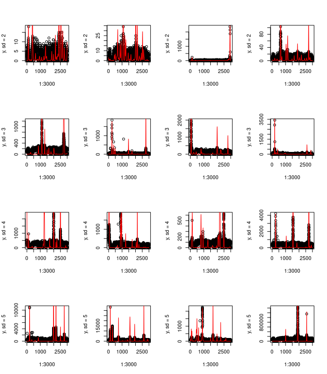
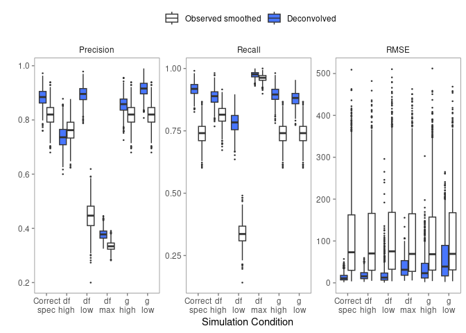

Deconvolution simulations
================

-   <a href="#dna-dna-matrix" id="toc-dna-dna-matrix">DNA-DNA matrix</a>
-   <a href="#coefficient-generation"
    id="toc-coefficient-generation">Coefficient generation</a>
-   <a href="#signal-localization" id="toc-signal-localization">Signal
    localization</a>
-   <a href="#signal-strength-estimation"
    id="toc-signal-strength-estimation">Signal strength estimation</a>
    -   <a href="#kcnq1ot1-like-1mb-domain"
        id="toc-kcnq1ot1-like-1mb-domain">Kcnq1ot1-like 1mb domain</a>
-   <a href="#sensitivity-specificity-precision-rmse-all-in-one-plot"
    id="toc-sensitivity-specificity-precision-rmse-all-in-one-plot">Sensitivity,
    specificity, precision, RMSE all in one plot</a>
    -   <a href="#mb-domain" id="toc-mb-domain">10mb domain</a>
-   <a href="#runtime" id="toc-runtime">Runtime</a>
    -   <a href="#fixed-df-vary-window-size"
        id="toc-fixed-df-vary-window-size">Fixed df, vary window size</a>
    -   <a href="#fixed-window-size-vary-df"
        id="toc-fixed-window-size-vary-df">Fixed window size, vary df</a>

This vignette shows all the simulations.

``` r
library(data.table)
library(dplyr)
```


    Attaching package: 'dplyr'

    The following objects are masked from 'package:data.table':

        between, first, last

    The following objects are masked from 'package:stats':

        filter, lag

    The following objects are masked from 'package:base':

        intersect, setdiff, setequal, union

``` r
library(tidyr)
library(ggplot2)
library(gridExtra)
```


    Attaching package: 'gridExtra'

    The following object is masked from 'package:dplyr':

        combine

``` r
library(pracma)
library(dcon)
set.seed(13579)
```

# DNA-DNA matrix

We used two different examples of DNA-DNA matrices. The first is 1mb
around the *Kcnq1ot1* domain on chr7. The second is a random 30mb chunk
from chr7.

``` r
# use real Kcnq1ot1 DNA-DNA matrix - has lots of contacts
dd1 <- readRDS(system.file("extdata", "rdsprite_kcnq1ot1_domain_DD.rds", package="dcon"))
plot_mat(dd1)
```



``` r
# use real chr7 30mb-60mb kinda big so takes a sec to plot
dd30 <- readRDS(system.file("extdata", "chr7_30-60mb_DD.rds", package="dcon"))
plot_mat(dd30)
```



# Coefficient generation

We experimented with a few different coefficient distributions and plot
some examples of their random signals here:

``` r
par(mfrow=c(4,4))
ddnorm <- normalize_hic(dd1, gamma=0.9)
for (i in 2:5) {
  for (j in 1:4) {
    sim <- dcon:::simulate_y(100, df=10, D=ddnorm, normalized=TRUE,
                             alpha_mean = 0, alpha_sd = i)
    plot(1:100, sim$y, ylab = paste('y, sd =',i))
    lines(1:100, exp(sim$B%*%sim$a), col='red')
  }
}
```



``` r
par(mfrow=c(4,4))
ddnorm <- normalize_hic(dd30, gamma=0.9)
for (i in 2:5) {
  for (j in 1:4) {
    sim <- dcon:::simulate_y(3000, df=100, D=ddnorm, normalized=TRUE,
                             alpha_mean = 0, alpha_sd = i)
    plot(1:3000, sim$y, ylab = paste('y, sd =',i))
    lines(1:3000, exp(sim$B%*%sim$a), col='red')
  }
}
```



In terms of a realistic count scale, we decided to omit instances where
the maximum observed $y$ value was less than $20$, and similarly,
omitted instances where the maximum observed $y$ value was greater than
$500$.

# Signal localization

Simulate a signal and find peaks on it. Coefficients are
$\mathcal{N}(0,5)$. Find peaks on the fitted estimate and see how much
overlap there is. Count it as correct if the fitted peak is present
within the tolerance range of the start and end of the true peak signal.

``` r
sim_localization <- function(B, len, 
                             df_true, df_fit,
                             ddnorm_true, ddnorm_fit,
                             label = '', tolerance = 2) {
  nreps <- 0
  results <- matrix(nrow = B, ncol = 8)
  colnames(results) <- paste0(c('fitTP_', 'fitFP_', 'fitTN_', 'fitFN_',
                                'rawTP_', 'rawFP_', 'rawTN_', 'rawFN_'), label)
  while (nreps < B) {
    sim <- dcon:::simulate_y(len, df=df_true, D=ddnorm_true, normalized=TRUE,
                             alpha_mean = 0, alpha_sd = 5)
    if (max(sim$y) < 20 | max(sim$y) > 500) {
      next
    }
    fit <- fit_decon(sim$y, ddnorm_fit, df=df_fit)
    rawfit <- fit_decon(sim$y, diag(len), df=df_fit)
    y <- as.numeric(exp(sim$B%*%sim$a))
    y_hat <- exp(fit$est)
    y_hat_raw <- exp(rawfit$est)
    true_peaks <- findpeaks(y, minpeakheight = quantile(y, 0.9))
    raw_peaks <- findpeaks(y_hat_raw, minpeakheight = quantile(y_hat_raw, 0.9))
    fit_peaks <- findpeaks(y_hat, minpeakheight = quantile(y_hat, 0.9))
    if (is.null(true_peaks)) {
      next
    }
    nreps <- nreps + 1
    # for fitted peak metrics
    if (is.null(fit_peaks)) {
      TP <- 0
      FP <- 0
      FN <- nrow(true_peaks)
      TN <- len-FN
    } else {
      true_ranges <- NULL
      fit_ranges <- NULL
      for (i in 1:nrow(true_peaks)) {
        true_ranges <- c(true_ranges, (true_peaks[i,2]-tolerance):(true_peaks[i,2]+tolerance))
      }
      true_ranges <- unique(true_ranges)
      for (i in 1:nrow(fit_peaks)) {
        fit_ranges <- c(fit_ranges, (fit_peaks[i,2]-tolerance):(fit_peaks[i,2]+tolerance))
      }
      fit_ranges <- unique(fit_ranges)
      TP <- sum(fit_peaks[,2] %in% true_ranges)
      FP <- nrow(fit_peaks)-TP
      FN <- sum(!true_peaks[,2] %in% fit_ranges)
      TN <- sum((!c(1:len)%in%true_ranges) & (!c(1:len)%in%fit_ranges))
    }
    results[nreps,1:4] <- c(TP,FP,TN,FN)
    # for raw peak metrics
    if (is.null(raw_peaks)) {
      TP <- 0
      FP <- 0
      FN <- nrow(true_peaks)
      TN <- len-FN
    } else {
      true_ranges <- NULL
      raw_ranges <- NULL
      for (i in 1:nrow(true_peaks)) {
        true_ranges <- c(true_ranges, (true_peaks[i,2]-tolerance):(true_peaks[i,2]+tolerance))
      }
      true_ranges <- unique(true_ranges)
      for (i in 1:nrow(raw_peaks)) {
        raw_ranges <- c(raw_ranges, (raw_peaks[i,2]-tolerance):(raw_peaks[i,2]+tolerance))
      }
      raw_ranges <- unique(raw_ranges)
      TP <- sum(raw_peaks[,2] %in% true_ranges)
      FP <- nrow(raw_peaks)-TP
      FN <- sum(!true_peaks[,2] %in% raw_ranges)
      TN <- sum((!c(1:len)%in%true_ranges) & (!c(1:len)%in%raw_ranges))
    }
    results[nreps,5:8] <- c(TP,FP,TN,FN)
  }
  return(results)
}

sim_metrics <- function(B, len, 
                        df_true, df_fit,
                        ddnorm_true, ddnorm_fit,
                        label = '') {
  replicate(B, {
    sim <- sim_localization(B=100, len, df_true, df_fit, ddnorm_true, ddnorm_fit, '')
    sim <- colSums(sim)
    z <- c(sim[1]/(sim[1]+sim[4]), sim[1]/(sim[1]+sim[2]),
           sim[5]/(sim[5]+sim[8]), sim[5]/(sim[5]+sim[6]))
    names(z) <- paste0(c('Fit_Recall_', 'Fit_Precision_',
                         'Raw_Recall_', 'Raw_Precision_'), label)
    z
  })
}
```

``` r
# These take a long time to run so i did it on the cluster with B=1000
B=1000
ddnorm <- normalize_hic(dd1, gamma=0.9)
# correctly specified
res <- sim_metrics(B, 100, 10, 10, ddnorm, ddnorm, label = 'Correct-spec')
allres <- res
# fewer df 
res <- sim_metrics(B, 100, 10, 5, ddnorm, ddnorm, 'df-low')
allres <- rbind(allres, res)
# more df
res <- sim_metrics(B, 100, 10, 15, ddnorm, ddnorm, 'df-high')
allres <- rbind(allres, res)
# max df
res <- sim_metrics(B, 100, 10, 100, ddnorm, ddnorm, 'df-max')
allres <- rbind(allres, res)
# conservative gamma
ddnorm2 <- normalize_hic(dd1, gamma=0.75)
res <- sim_metrics(B, 100, 10, 10, ddnorm, ddnorm2, 'g-low')
allres <- rbind(allres, res)
# high gamma
ddnorm2 <- normalize_hic(dd1, gamma=0.95)
res <- sim_metrics(B, 100, 10, 10, ddnorm, ddnorm2, 'g-high')
allres <- rbind(allres, res)
```

# Signal strength estimation

Simulate a signal and compute the RMSE and MAD.

``` r
sim_signal_strength <- function(B, len, 
                                df_true, df_fit,
                                ddnorm_true, ddnorm_fit,
                                label = '') {
  nreps <- 0
  results <- matrix(nrow = B, ncol = 4)
  colnames(results) <- paste0(c('Fit_RMSE_', 'Fit_MAD_',
                                'Raw_RMSE_', 'Raw_MAD_'), label)
  while (nreps < B) {
    sim <- dcon:::simulate_y(len, df=df_true, D=ddnorm_true, normalized=TRUE,
                             alpha_mean = 0, alpha_sd = 5)
    if (max(sim$y) < 20 | max(sim$y) > 500) {
      next
    }
    nreps <- nreps + 1
    fit <- fit_decon(sim$y, ddnorm_fit, df=df_fit)
    fit_raw <- fit_decon(sim$y, diag(len), df=df_fit)
    y <- exp(sim$B%*%sim$a)
    y_hat <- exp(fit$est)
    y_hat_raw <- exp(fit_raw$est)
    results[nreps,] <- c(sqrt(mean((y-y_hat)**2)), median(abs(y-y_hat)),
                         sqrt(mean((y-y_hat_raw)**2)), median(abs(y-y_hat_raw)))
  }
  return(results)
}
```

## Kcnq1ot1-like 1mb domain

``` r
B <- 1000
ddnorm <- normalize_hic(dd1, gamma=0.9)
# correctly specified
res <- sim_signal_strength(B, 100, 10, 10, ddnorm, ddnorm, 'Correct-spec')
allres2 <- res
# fewer df 
res <- sim_signal_strength(B, 100, 10, 5, ddnorm, ddnorm, 'df-low')
allres2 <- cbind(allres2, res)
# more df
res <- sim_signal_strength(B, 100, 10, 15, ddnorm, ddnorm, 'df-high')
allres2 <- cbind(allres2, res)
# max df
res <- sim_signal_strength(B, 100, 10, 100, ddnorm, ddnorm, 'df-max')
allres2 <- cbind(allres2, res)
# conservative gamma
ddnorm2 <- normalize_hic(dd1, gamma=0.75)
res <- sim_signal_strength(B, 100, 10, 10, ddnorm, ddnorm2, 'g-low')
allres2 <- cbind(allres2, res)
# high gamma
ddnorm2 <- normalize_hic(dd1, gamma=0.95)
res <- sim_signal_strength(B, 100, 10, 10, ddnorm, ddnorm2, 'g-high')
allres2 <- cbind(allres2, res)
```

# Sensitivity, specificity, precision, RMSE all in one plot

``` r
data.frame(allres2) |>
  pivot_longer(cols = everything()) |>
  separate(name, into = c('fit','metric', 'sim'), sep='_') |>
  filter(metric == 'RMSE') |>
  mutate(metric = 'RMSE') |>
  bind_rows(
    data.frame(t(allres)) |>
      pivot_longer(cols = everything()) |>
      separate(name, into = c('fit','metric', 'sim'), sep='_')
  ) |>
  mutate(sim = gsub('\\.','\n',sim)) |>
  ggplot(aes(x = sim, y = value)) +
  geom_boxplot(aes(fill = fit)) +
  scale_fill_manual(name = '', breaks = c('Raw','Fit'), values = c('white','royalblue1'), labels = c('Observed smoothed', 'Deconvolved')) +
  facet_wrap(metric ~ ., scales = 'free_y', nrow=1) +
  theme_minimal() +
  theme(panel.border = element_rect(color = "gray 50", fill = NA),
        panel.grid.major = element_blank(),
        panel.grid.minor = element_blank(),
        axis.ticks = element_line(color='gray 50'),
        legend.position = 'bottom') +
  xlab('Simulation Condition') +
  ylab('')
ggsave('simulation-metrics.pdf', height=3, width=6.5)
```

``` r
# (version where i ran it with B=1000 on the cluster)
allres <- NULL
for (i in 1:6) {
  res <- readRDS(paste0('../paper/run_loc_sim_result_',i,'.rds'))
  if (is.null(allres)) {
    allres <- res
  } else {
    allres <- rbind(allres, res)
  }
}
data.frame(allres2) |>
  pivot_longer(cols = everything()) |>
  separate(name, into = c('fit','metric', 'sim'), sep='_') |>
  filter(metric == 'RMSE') |>
  mutate(metric = 'RMSE') |>
  bind_rows(
    data.frame(t(allres)) |>
      pivot_longer(cols = everything()) |>
      separate(name, into = c('fit','metric', 'sim'), sep='_')
  ) |>
  mutate(sim = gsub('\\.','\n',sim)) |>
  ggplot(aes(x = sim, y = value)) +
  geom_boxplot(aes(fill = fit), outlier.size=0.25) +
  scale_fill_manual(name = '', breaks = c('Raw','Fit'), values = c('white','royalblue1'), labels = c('Observed smoothed', 'Deconvolved')) +
  facet_wrap(metric ~ ., scales = 'free_y', nrow=1) +
  theme_minimal() +
  theme(panel.border = element_rect(color = "gray 50", fill = NA),
        panel.grid.major = element_blank(),
        panel.grid.minor = element_blank(),
        axis.ticks = element_line(color='gray 50'),
        legend.position = 'top') +
  xlab('Simulation Condition') +
  ylab('')
```



``` r
ggsave('simulation-metrics.pdf', height=3, width=6.5)
```

## 10mb domain

``` r
B <- 10
ddnorm <- normalize_hic(dd30[2001:3000,2001:3000], gamma=0.9)
# correctly specified
res <- sim_signal_strength(B, 1000, 100, 100, ddnorm, ddnorm, 'Correctly-specified')
allres <- res
# fewer df 
res <- sim_signal_strength(B, 1000, 100, 50, ddnorm, ddnorm, 'DF-low')
allres <- cbind(allres, res)
# more df
res <- sim_signal_strength(B, 1000, 100, 150, ddnorm, ddnorm, 'DF-high')
allres <- cbind(allres, res)
# max df
res <- sim_signal_strength(B, 1000, 100, 1000, ddnorm, ddnorm, 'DF-max')
allres <- cbind(allres, res)
# conservative gamma
ddnorm2 <- normalize_hic(dd, gamma=0.75)
res <- sim_signal_strength(B, 1000, 100, 100, ddnorm, ddnorm2, 'Gamma-low')
allres <- cbind(allres, res)
# high gamma
ddnorm2 <- normalize_hic(dd, gamma=0.95)
res <- sim_signal_strength(B, 1000, 100, 100, ddnorm, ddnorm2, 'Gamma-high')
allres <- cbind(allres, res)


data.frame(allres) |>
  pivot_longer(cols = everything()) |>
  separate(name, into = c('metric', 'sim'), sep='_') |>
  mutate(sim = gsub('\\.','\n',sim)) |>
  ggplot(aes(x = sim, y = value)) +
  geom_boxplot() +
  facet_wrap(metric ~ ., scales = 'free_y') +
  theme_minimal()
```

# Runtime

## Fixed df, vary window size

## Fixed window size, vary df

``` r
sessionInfo()
```

    R version 4.2.2 (2022-10-31)
    Platform: x86_64-pc-linux-gnu (64-bit)
    Running under: Rocky Linux 8.7 (Green Obsidian)

    Matrix products: default
    BLAS/LAPACK: /usr/lib64/libopenblasp-r0.3.15.so

    locale:
     [1] LC_CTYPE=en_US.UTF-8       LC_NUMERIC=C              
     [3] LC_TIME=en_US.UTF-8        LC_COLLATE=en_US.UTF-8    
     [5] LC_MONETARY=en_US.UTF-8    LC_MESSAGES=en_US.UTF-8   
     [7] LC_PAPER=en_US.UTF-8       LC_NAME=C                 
     [9] LC_ADDRESS=C               LC_TELEPHONE=C            
    [11] LC_MEASUREMENT=en_US.UTF-8 LC_IDENTIFICATION=C       

    attached base packages:
    [1] stats     graphics  grDevices utils     datasets  methods   base     

    other attached packages:
    [1] dcon_0.0.0.9000   pracma_2.4.2      gridExtra_2.3     ggplot2_3.4.0    
    [5] tidyr_1.2.1       dplyr_1.0.10      data.table_1.14.6

    loaded via a namespace (and not attached):
     [1] Rcpp_1.0.9             lattice_0.20-45        deldir_1.0-6          
     [4] assertthat_0.2.1       digest_0.6.31          utf8_1.2.2            
     [7] spatstat.core_2.4-4    R6_2.5.1               GenomeInfoDb_1.34.4   
    [10] plyr_1.8.8             stats4_4.2.2           evaluate_0.19         
    [13] tensor_1.5             pillar_1.8.1           zlibbioc_1.44.0       
    [16] rlang_1.0.6            rstudioapi_0.14        S4Vectors_0.36.1      
    [19] rpart_4.1.19           goftest_1.2-3          Matrix_1.5-3          
    [22] rmarkdown_2.19         textshaping_0.3.6      labeling_0.4.2        
    [25] splines_4.2.2          stringr_1.5.0          RCurl_1.98-1.9        
    [28] polyclip_1.10-4        munsell_0.5.0          spatstat.data_3.0-0   
    [31] compiler_4.2.2         xfun_0.35              systemfonts_1.0.4     
    [34] pkgconfig_2.0.3        BiocGenerics_0.44.0    mgcv_1.8-41           
    [37] htmltools_0.5.4        tidyselect_1.2.0       spatstat.random_3.0-1 
    [40] tibble_3.1.8           GenomeInfoDbData_1.2.9 codetools_0.2-18      
    [43] IRanges_2.32.0         fansi_1.0.3            withr_2.5.0           
    [46] bitops_1.0-7           grid_4.2.2             nlme_3.1-161          
    [49] jsonlite_1.8.4         gtable_0.3.1           lifecycle_1.0.3       
    [52] DBI_1.1.3              magrittr_2.0.3         scales_1.2.1          
    [55] cli_3.4.1              stringi_1.7.8          farver_2.1.1          
    [58] XVector_0.38.0         reshape2_1.4.4         ragg_1.2.4            
    [61] ellipsis_0.3.2         generics_0.1.3         vctrs_0.5.1           
    [64] spatstat.utils_3.0-1   RColorBrewer_1.1-3     tools_4.2.2           
    [67] glue_1.6.2             purrr_0.3.5            abind_1.4-5           
    [70] fastmap_1.1.0          yaml_2.3.6             spatstat.sparse_3.0-0 
    [73] colorspace_2.0-3       GenomicRanges_1.50.1   spatstat.geom_3.0-3   
    [76] knitr_1.41            
